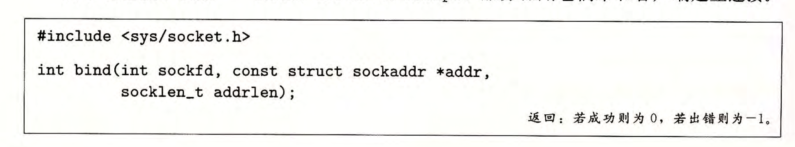

对于有些函数，由于既要支持IPV4（无符号32位整形地址），又要支持IPV6（16个字节，每个字节是一个`uint8_t`类型），所以对于一些参数可能会使用`const void*`作为变量类型。  
IP地址和端口号总是以网络字节顺序（大端法）存放。

#### sock编程函数

IP地址为一个32位无符号整数。  
这里就是简单把一个uint32_t定义为一个结构体in_addr(internetAddress)  
  
注意这里是按照大端法来存的。

  
hton是返回网络字节，而ntoh是返回主机字节，后缀l代表long，所以是32位，s代表short，所以是16位。  
网络字节就是大端法，而主机字节就是小端法。

  
p代表表示（什么表示？点分十进制串），n代表网络（二进制网络字节顺序，也就是大端法）。


这里就是套接字地址结构，\_in表示internet（互联网络）。  
注意sockaddr_in是sockaddr的一个子类，观察可以发现他们的字节数是一样的，所以内存大小表示上是兼容的。

这里注意ip地址和端口号都是按照网络字节顺序也就是大端法存放。

```c
typedef struct sockaddr SA;
```

#### socket函数。

客户端和服务器用。  
  
AF_INET表示IPV4，AF_INET6表示IPV6。  
SOCK_STREAM表示这个套接字是连接的一个端点（connection）。

使套接字成为连接的一个端点：

```c
clientfd = Socket(AF_INET,SOCK_STREAM,0);
```

#### connect函数

客户端用来与服务器建立连接。  
  
connect函数会阻塞，一直到连接成功建立或是发生错误。  
addrlen就是sizeof(sockaddr_in)。(注意IPV6的话就是sockaddr_in6了，所以不同情况传入参数也是不一样的)  
一旦连接成功，clientfd描述符就准备好可以读写了。



#### bind,listen,accept

这三个函数是服务器用来与客户端建立连接的。  
  
bind函数会告诉内核将addr中的服务器套接字地址和套接字描述符sockfd联系起来。

默认情况，内核认为socket函数创建的描述符对应与主动套接字（active socket），这存在与一个连接的客户端。

  
listen函数告诉内核描述符是被服务器而不是客户端使用的。  
listen函数可以将sockfd从一个主动套接字转化为一个监听套接字(listening socket)，所以这个套接字可以接受来自客户端的连接请求。  
backlog参数指内核在开始拒绝连接请求之前，队列中要排队的未完成的连接请求的数量。一般设置为一个较大的1024。

  
accept函数是服务器调用的，用来等待来自客户端的连接请求。accept函数等待来自客户端的连接请求到达侦听描述符listenfd，然后在addr中填写客户端的套接字地址，返回一个已连接描述符。（这个时候的已连接描述符可以用来利用Unix I/O函数与客户端通信）

监听描述符是作为客户端连接请求的一个端点，通常被创建一次然后存在于服务器的整个生命周期。  
而已连接描述符是客户端和服务器之间已经建立起来了的连接的一个端点，服务器每次接受连接请求时都会创建一次，只存在于服务器为一个客户端服务的过程中。


#### getaddrinfo

返回一个addrinfo结构体链表。  
  
host是可以设置为服务器ip地址，或者域名。  
service可以设置具体的端口号，或者服务名，如http（表示web，端口号为80），或者https（表示加密的http服务，端口号为443）。  
ftp -> 端口号 21（用于文件传输协议）  
smtp -> 端口号 25（用于简单邮件传输协议）  
imap -> 端口号 143（用于互联网邮件访问协议）  
pop3 -> 端口号 110（用于邮局协议）

hints参数指向一个addrinfo结构体，这个结构体一般先memset为0，然后可以设置ai_family、ai_socktype、ai_protocol和ai_flags字段来对getaddrinfo函数返回的结构体作出一定的限制。

在 IPv4 中，0.0.0.0 被称为通配符地址。它表示当前主机上的所有网络接口或任何可用的网络地址。当套接字绑定到 0.0.0.0 时，程序会接受来自任何网络接口的连接请求，而不仅仅是某个特定接口的请求。对于服务器来说，绑定到 0.0.0.0 意味着它会监听所有本地的 IP 地址，而不仅仅是某一个特定的地址。

当你把host设置为NULL时，最好设置一下AI_PASSIVE，告诉函数返回的套接字地址可能被服务器用作监听套接字。这个时候得到的套接字地址结构中的地址字段将会是通配符地址，告诉内核这个服务器会接受发送到该主机的所有IP地址的请求。


更详细一些的addrinfo解释：  
`addrinfo` 结构体是 `getaddrinfo` 函数返回的结果数据结构，它包含了网络地址和相关信息。在进行网络编程时，`getaddrinfo` 用于解析主机名、服务名等，最终返回一个 `addrinfo` 结构体链表，其中包含了多个网络地址。每个 `addrinfo` 结构体都包含了该地址的一些信息，包括地址的类型、协议、地址本身等。

### `struct addrinfo` 结构体定义

下面是 `addrinfo` 结构体的定义（位于 `<netdb.h>` 头文件中）：

```c
struct addrinfo {
    int              ai_flags;        // 标志位
    int              ai_family;       // 地址族（如 AF_INET, AF_INET6）
    int              ai_socktype;     // 套接字类型（如 SOCK_STREAM, SOCK_DGRAM）
    int              ai_protocol;     // 协议类型（如 IPPROTO_TCP, IPPROTO_UDP）
    size_t           ai_addrlen;      // 地址长度
    char            *ai_canonname;    // 主机的标准名称（如果可用）
    struct sockaddr *ai_addr;         // 地址指针
    struct addrinfo *ai_next;         // 下一个地址信息结构体（链表）
};
```

### 各个字段的详细解释

1.  **`ai_flags`** (int)
    
    - 这是一个标志位字段，通常用于指定 `getaddrinfo` 的行为。它是一个 **位掩码**，可以包含多个标志位，每个标志位都控制 `getaddrinfo` 解析行为的不同方面。
    - 常见的标志值：
        - `AI_PASSIVE`：返回适用于被动套接字的地址（通常是服务器端）。当设置了这个标志时，返回的地址可以绑定到任意本地地址，通常用 `INADDR_ANY` 或 `::`（IPv6）作为地址。
        - `AI_CANONNAME`：请求返回主机的标准（正式）名称。如果设置了这个标志，返回的 `ai_canonname` 字段会包含该主机的规范名称。
        - `AI_NUMERICHOST`：表示 `node` 是一个已经是数字形式的主机名或 IP 地址，不需要进一步解析。
        - `AI_NUMERICSERV`：表示 `service` 是数字形式的端口号，而不是服务名称。
2.  **`ai_family`** (int)
    
    - 这个字段表示地址的 **地址族**，即使用的网络协议类型。常见的值包括：
        - `AF_INET`：IPv4 地址族，表示使用 IPv4 地址。
        - `AF_INET6`：IPv6 地址族，表示使用 IPv6 地址。
        - `AF_UNSPEC`：表示未指定地址族，`getaddrinfo` 会返回所有支持的地址族（IPv4 和 IPv6）列表。
3.  **`ai_socktype`** (int)
    
    - 这个字段指定套接字的 **类型**，即套接字通信的方式。常见的值包括：
        - `SOCK_STREAM`：流式套接字，通常用于 TCP 协议。
        - `SOCK_DGRAM`：数据报套接字，通常用于 UDP 协议。
        - `SOCK_RAW`：原始套接字，允许访问底层协议（如 ICMP）。
4.  **`ai_protocol`** (int)
    
    - 这个字段指定与套接字类型配套使用的 **协议类型**。常见的值包括：
        
        - `IPPROTO_TCP`：表示 TCP 协议（通常与 `SOCK_STREAM` 配对）。
        - `IPPROTO_UDP`：表示 UDP 协议（通常与 `SOCK_DGRAM` 配对）。
        - `IPPROTO_IP`：表示 IP 协议，通常用于原始套接字（`SOCK_RAW`）。
    - 如果设置了 `ai_socktype` 和 `ai_protocol`，`getaddrinfo` 会根据这些字段返回合适的协议和套接字类型。如果 `ai_protocol` 设置为 `0`，`getaddrinfo` 会选择默认的协议。
        
5.  **`ai_addrlen`** (size_t)
    
    - 该字段表示 **`ai_addr`** 指向的地址结构的长度。通常，它应该是一个 **`struct sockaddr`** 或其派生结构体（如 `struct sockaddr_in` 或 `struct sockaddr_in6`）的大小。
    - 例如，如果地址是 IPv4 地址（`struct sockaddr_in`），则 `ai_addrlen` 的值是 `sizeof(struct sockaddr_in)`；如果是 IPv6 地址（`struct sockaddr_in6`），则 `ai_addrlen` 的值是 `sizeof(struct sockaddr_in6)`。
6.  **`ai_addr`** (struct sockaddr \*)
    
    - 这是一个指向地址的指针，类型为 `struct sockaddr *`，它是一个通用的套接字地址结构指针。根据 `ai_family` 的不同，它可能指向不同类型的地址结构：
        - 如果 `ai_family` 是 `AF_INET`，则 `ai_addr` 指向 `struct sockaddr_in`，它包含 IPv4 地址和端口信息。
        - 如果 `ai_family` 是 `AF_INET6`，则 `ai_addr` 指向 `struct sockaddr_in6`，它包含 IPv6 地址和端口信息。
        - 如果 `ai_family` 是 `AF_UNSPEC`，则它可能指向任意支持的地址族的地址。
7.  **`ai_canonname`** (char \*)
    
    - 这个字段包含主机的 **规范名称**（canonical name），即该主机的正式域名。如果使用了 `AI_CANONNAME` 标志，`getaddrinfo` 会填充该字段。
    - 例如，如果你查询 `www.example.com`，并且解析过程中获取了与 `www.example.com` 相关的 IP 地址，`ai_canonname` 字段可能会包含类似 `www.example.com` 的字符串，表示这是该主机的正式名称。
8.  **`ai_next`** (struct addrinfo \*)
    
    - 这是一个指向下一个 `addrinfo` 结构体的指针。`getaddrinfo` 函数返回的是一个链表，每个链表节点包含一个网络地址和相关信息。`ai_next` 用来连接这些链表节点。
    - 如果 `getaddrinfo` 返回多个结果（例如，支持 IPv4 和 IPv6 的地址），则这些地址会被链接在一起。程序可以遍历这个链表，尝试每个地址，直到找到一个可用的连接。

### 使用 `addrinfo` 结构体的过程

1.  调用 `getaddrinfo` 时，传入主机名、服务名以及 `addrinfo` 结构体的提示信息（`hints`）。
2.  `getaddrinfo` 根据输入的主机名、服务名和提示信息（如 `AI_PASSIVE`、`AI_CANONNAME`）返回一个或多个 `addrinfo` 结构体。
3.  遍历返回的 `addrinfo` 链表，使用每个 `addrinfo` 中的地址信息进行套接字创建和连接。
4.  最后，释放 `getaddrinfo` 分配的内存，使用 `freeaddrinfo` 函数。

#### getnameinfo函数

这个函数与getaddrinfo函数起的作用是相反的，它将一个套接字地址结构转换成相应的主机和服务名字符串。  
  
将sa指针指向的sockaddr结构体，长度为salen转换为主机和服务名字符串，并把它们分别复制到缓存区长度为hostlen的host指针指向的位置和缓存区长度为servlen的service指针指向的位置。

flags为一个位掩码，可修改默认行为（默认是返回可能是英文字母组成的名字），可以用or来组合这些位掩码。  
`NI_NUMERICHOST`：返回数字地址字符串而不是域名。  
`NI_NUMERICSERV`: getnameinfo默认检查/etc/services去寻找服务名而不是端口号，设置这个标志可以使函数跳过查找，简单返回端口号。

#### open_clientfd

客户端调用open_clientfd建立与服务器的连接。  
  
该服务器运行在主机hostname上，并且在port上监听连接请求，函数将返回一个打开的套接字描述符，并且是已准备好的，可以直接用Unix I/O函数做输入和输出。

#### open_listenfd

服务器调用open_listenfd函数创建一个监听描述符，准备好接收连接请求。  


UDP的传输方式为数据报（不面向连接），而TCP（为面向连接）为流式传输。
MAC地址占用6个字节。
LAN帧由LAN帧头和互联网络包组成。
TCP可以实现流量控制。

当在服务端使用getaddrinfo函数时，应设置flags参数为AI_PASSIVE，这时返回的地址是用于绑定服务器套接字（Socket）的地址，这个时候如果host设置了NULL，则返回的是通配符地址（0.0.0.0）。

应用层->传输层->互联网层（网络层）->网络接口层（又分为数据链路层和物理层）。

每一层可以给数据包前面加头（额外数据）来定向需要传输的位置，然后传输到某个地方时再把包头去除。网络层的数据传输是多跳传输。路由器存在网络层->数据链路层->物理层。

1B=8b;(1 Byte = 8 bits)。

IP地址按接口分配。电脑每个网络接口都有一个IP。
IP地址分为网络地址和主机号两个部分。可以根据网络地址的类别来确定有多少个子网。
子网掩码可以去分开IP的网络地址和主机号，然后再做进一步的操作。
主机号全1和全0是两个特殊的，不能分配。

主机号全 0 的地址表示网络地址（Network Address）。
例如，在一个子网中，如果 IP 地址是 192.168.1.0/24，那么 192.168.1.0 就是这个子网的网络地址，不能分配给主机。

主机号全 1 的地址表示广播地址（Broadcast Address）。
例如，在同一个子网中，192.168.1.255 是广播地址，用于向子网中的所有主机发送广播消息。

在同一个子网内，可以通过MAC地址通信，如果用IP地址通信的话需要到达路由器的网络层，增加了花销，故直接来链路层交换机。

标准 I/O 能在 CGI 程序里工作的原因是，在子进程中运行的 CGI 程序不需要显式地关闭它的输入输出流。当子进程终止时，内核会自动关闭所有描述符。Web 服务器将 CGI 程序的标准输入和标准输出重定向为网络套接字。标准 I/O 的缓冲区会在程序退出时自动刷新，确保所有数据都被发送。

网络编程中，我们用rio_write和rio_readlineb来对网络套接字进行读写操作，保证读写的安全。

fd = file descriptor。
connfd = connection file descriptor。

思考一下，当你往一个函数传入的参数是一个指针的时候，你可以在函数内调用指针的内容，同时也可以修改或者填充指针指向地址的内容。