# 7.1 编译器驱动程序

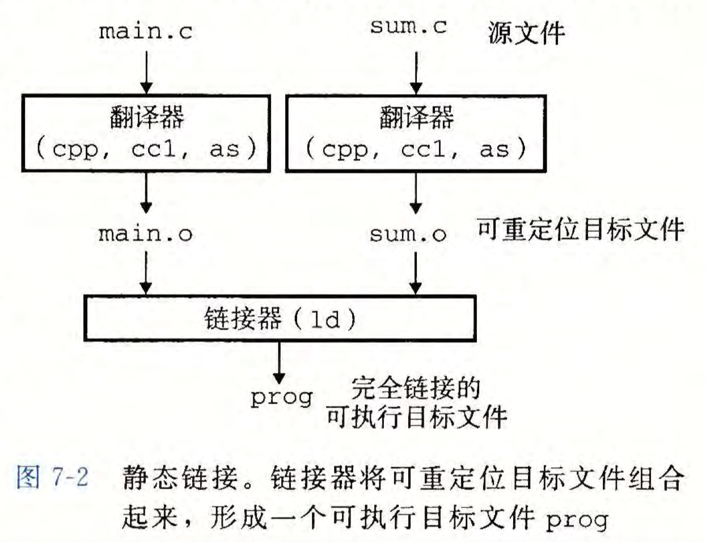  
1.C预处理器（cpp）将`main.c`翻译为`main.i`（ASCII码）

```shell
cpp [other arguments] main.c /tmp/main.i
```

2.C编译器（cc1）将`main.i`翻译为`main.s`（ASCII汇编语言文件）

```shell
cc1 [other arguments] /tmp/main.i -Og -o /tmp/main.s
```

3.汇编器(as)将`main.s`翻译为`main.o`（可重定位目标文件）

```shell
as [other arguments] -o /tmp/main.o /tmp/main.s
```

相同的过程生成sum.o

4.连接器程序(ld)将main.o和sum.o已经一些必要的系统目标文件组合起来，生成prog（可执行目标文件）

```shell
ld -o prog [system object files and args] main.o sum.o
```

接着，运行指令

```shell
linux> ./prog
```

即可调用加载器(loader)，将prog中的代码和数据复制到内存，然后将控制转移到程序的开头。

# 7.2 静态链接

符号解析和重定位  


目标文件纯粹是字节块的集合。

# 7.3 目标文件

  
目标模块——>其实就是字节序列  
目标文件——>以文件形式存放在磁盘中的目标模块  
目标文件的格式: a.out，PE， Mach-O，ELF

# 7.4 可重定位目标文件

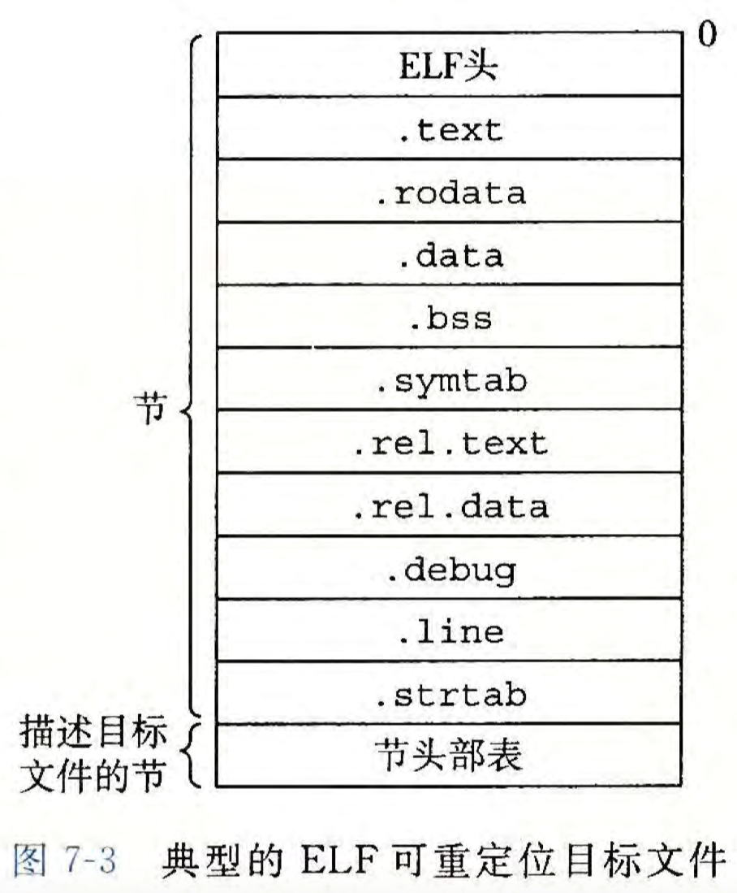  
`.text` 已编译程序的机器代码  
`.rodata`只读数据，比如printf语句中的格式串和开关语句的跳转表  
`.data` 已初始化的全局和静态C变量。  
局部C变量在运行时被保存在栈中，不出现在.data节和.bss节  
`.bss` 未初始化的全局和静态C变量，所有被初始化为0的全局或静态变量。  
这个节不占用磁盘空间，运行时在内存中分配这些变量并初始化为0。  
`.symtab` 一个符号表，存放了程序中定义和引用的函数和全局变量的信息。  
每个可重定位目标文件在.symtab中都有一张符号表（除非用STRIP命令去除）。  
与编译器中符号表不一致，.symtab符号表不包含局部变量的条目。  
`.rel.text` 一个.text节中位置的列表，当链接器把此目标文件和其他文件组合时，需要修改这些位置。  
若指令调用外部函数或引用全局变量则需要修改。  
若指令调用本地函数则不需要修改。  
可执行目标文件中通常省略，除非显式地指示包含。  
`.rel.data` 被模块引用或定义的所有全局变量的重定位信息。  
任何已初始化的全局变量，若初始值为全局变量地址或外部定义函数的地址，则需要被修改。  
`.debug` 一个调试符号表，其条目是程序中定义的局部变量和类型定义，程序中定义和引用的全局变量，以及原始的C源文件。  
必须以-g选项调用编译器驱动程序时才含有此表。  
`.line` 原始C源程序中的行号和.text节中机器指令之间的映射。  
同样只有以-g选项调用编译器驱动程序时，才会得到这张表。  
`.strtab` 一个字符串表，其内容包括.symtab和.debug中的符号表，以及节头部中的节名字。  
字符串表就是以null结尾的字符串的序列。

# 7.5 符号和符号表

符号表包含m定义和引用的符号的信息。（m为一个可重定位目标模块）  
包括三种不同的符号。  
1.由模块m定义并能被其他模块引用的`全局符号`。  
全局链接器符号对应于非静态的C函数和全局变量。  
2.由其他模块定义并被模块m引用的`全局符号`。  
这个又叫做`外部符号`，对应于在其他模块中定义的非静态C函数和全局变量。  
3.只被模块m定义和应用的`局部符号`。  
对应于带static属性的C函数和全局变量。  
这些符号在模块m中任何位置都可见，但是不能被其他模块引用。

本地链接器符号和本地程序变量是不同的！！  
.symtab中的符号表不包含对应于本地非静态程序变量的任何符号。  
这些符号在运行时在栈中被管理，不归链接器管。

带有C static属性的本地过程变量是不在栈中管理的，编译器在`.data`或者`.bss`中为每个定义分配空间，并在符号表中创建一个有唯一名字的本地链接器符号。

```c
int f(){
    static int x = 0;
    return x;
}

int g(){
    static int x = 1;
    return x;
}
```

编译器会向汇编器输出两个不同名字的局部链接器符号。x.1，x.2这样。

在C语言中，源文件扮演了模块的角色，static被用来隐藏变量和函数名字。  
任何带有static属性声明的全局变量或者函数都是模块私有的，任何不带有static属性声明的全局变量和函数都是公共的，可以被其他模块访问。

符号表是由汇编器构造，使用编译器输出到汇编语言.s文件中的符号。  
.symtab节中包含ELF符号表，在这张表中包含一个条目的数组，每个条目的格式如下：

```c
typedef struct {
    int name; /* 字符串名字偏移 */
    char type:4, // 表明它是个函数还是数据 （4bits）
                binding:4;// 表明它是本地的还是全局的（4bits）
    char reserved; // 有没有被用
    short section; // 整数索引标识节
    long value; // 在节中的偏移或者绝对地址
    long size; // 目标的大小，单位是bytes(8bits)
} Elf64_Symbol;
```

每个符号被分配到目标文件的某个节中，由section字段标识，这是一个到节头部表的索引。  
存在三个伪节，在节头部表中没有条目。  
`ABS`代表不该被重定位的符号。  
`UNDEF`代表未定义的符号，就是说，在本目标模块中引用了，但是却是在其他地方定义的符号。  
`COMMON`表示还没有被分配位置的未初始化的数据目标。

关于`COMMON`符号，value字段给出了它的对齐要求，size给出了它的最小的大小。

只有可重定位目标文件中才有这些伪节，可执行目标文件中是没有到。

`COMMON` 未初始化的全局变量  
`.bss` 未初始化的静态变量，以及初始化为0的全局或静态变量。

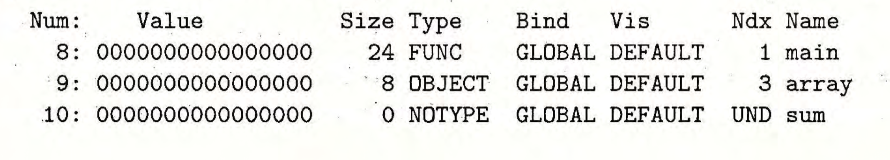

这是一个可重定位目标文件main.o的符号表中最后三个条目。（条目的Num从0开始，最开始的8个条目没有显示出来）  
Ndx=1标识.text节，故main是一个位于.text节中偏移量为0（也就是这里的Value值），大小为24的函数。

# 7.6 符号解析

`链接器解析符号引用`：  
将每个引用与它输入的可重定位目标文件的符号表中的一个确定的符号定义关联起来。  
对于和引用定义在相同模块中的局部符号的引用，编译器只允许每个模块中每个局部符号有一个定义，静态局部变量也会有本地链接器符号，并有唯一的名字。  
对于全局符号的引用解析，当编译器遇到一个非当前模块中定义的符号（变量或函数名），会假设该符号实在其他某个模块中定义的，生成一个链接器符号表条目，交给链接器。  
若链接器在任何输入模块中都找不到这个被引用的符号的定义，就输出一个错误信息并终止。

```c
void foo(void);

int main(){
    foo();
    return 0;
}
```

这里的例子就是一个没有被定义的函数，编译器会假定其他源文件有foo函数的定义，不过实际上没有，所以就报错。

多个目标文件也可能会定义相同名字的全局符号：

#### 链接器解析多重定义的全局符号

向链接器输入一组可重定位的目标模块，每个模块定义一组符号，假设多个模块定义了同名的全局符号。

编译器向汇编器输出每个全局符号，或者是强(strong)或者是弱(weak)，汇编器将此信息隐含地编码在可重定位目标文件的符号表里。  
`函数和已初始化的全局变量是强符号，未初始化的全局变量是弱符号`  
`rule1` 不允许有多个同名的强符号  
`rule2` 如果有一个强符号和多个弱符号同名，那么选择强符号。  
`rule3` 如果有多个弱符号同名，那么从这些弱符号中任意选择一个。  
‌静态变量不属于强符号或弱符号‌。在C语言中，强符号和弱符号的概念主要应用于全局变量和函数。

假如选择了一个强符号，而这个强符号在其他的模块（源文件）中被定义为了其他的类型，那么在这个被定义为其他类型的模块中对这个符号的操作可能会导致内存的溢出覆盖。

编译器遇见弱全局符号，没有办法判断其他模块是否定义了x，如果是，也没有办法预测链接器应该使用x的多重定义中的哪一个。故分配为`COMMON`，将最终决定权留给链接器。

另一方面，如果x初始化为0，则它为一个强符号，必须唯一，故可以直接分配给.bss。类似的，静态符号的构造必须唯一，故编译器可以分为`.data`和`.bss`。

类似于

```c
void main(){
    
}
```

这种是已经定义了的强符号。

```c
void main();
```

则是没有被定义的弱符号。

#### 与静态库链接

链接器可以读取一组可重定位的目标文件，并把它们链接起来，形成一个输出的可执行文件。  
实际上，编译系统中也有一种机制是将所有相关的目标模块打包成为一个单独的文件，称为`静态库`，也可以用做链接器的输入。  
如标准库函数，相关的函数被编译为独立的目标模块，然后封装成一个单独的静态库文件。比如说我们在main.c中想要使用C标准库和数学库中函数的程序。

```shell
linux> gcc main.c /usr/lib/libm.a /usr/lib/libc.a
```

同时，在链接的时候，链接器将只复制被程序引用的目标模块，减少了可执行文件在磁盘和内存中的大小。  
(实际上C编译器驱动程序总是将libc.a传送给链接器)  
静态库的文件格式为存档（archive），存档是一组连接起来的可重定位目标文件的集合，存在一个头部描述每个成员目标文件的大小和位置。文件名后缀为.a。

怎么创建静态库？使用AR工具。

```shell
linux> gcc -c addvec.c mulvec.c
linux> ar rcs libvector.a addvec.o multvec.o
```

怎么使用静态库？编译和链接输入文件main.o和libvector.a

```shell
linux> gcc -c main2.c
linux> gcc -static -o prog2c main2.o ./libvector.a
```

这里的`-static`参数告诉编译器驱动程序，链接器应该构建一个完全链接的可执行目标文件，它可以加载到内存并运行，在加载时无须更进一步的链接。  
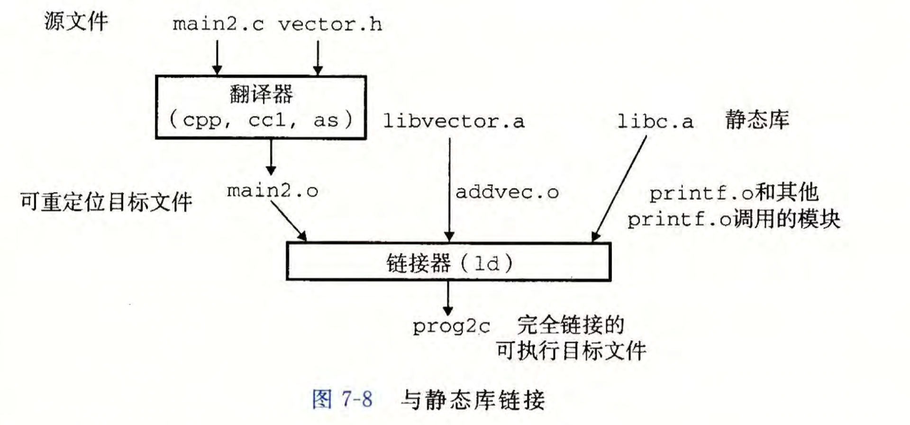  
链接器运行时，判定main2.o中引用的那些符号部分，所以复制了需要的模块并链接，对于没有用到到部分，链接器就不会复制。

#### 链接器如何使用静态库来解析引用

链接器是按照文件从左到右在命令行中出现的顺序进行解析，并维护一个可重定位的目标文件集合E（在这个集合中的文件会被合并起来形成可执行文件），一个未解析的符号（即引用了但是尚未定义的符号）集合U，以及一个在前面输入文件中已定义的符号集合D。

`1`对于每个输入文件f，若f是一个目标文件，把f添加到E，修改U和D反映f中的符号定义和引用，继续下一个输入文件。

`2`若f为一个存档文件，链接器尝试匹配U中未解析的符号和由存档文件成员定义的符号。若某个存档文件成员m，定义了一个符号来解析U中的一个引用，则添加m到E，修改U和D。  
存档文件中所有的成员目标文件都会依次进行这个过程，直到U和D都不再发生变化。任何不包含在E中都成员目标文件都会被简单的丢弃。然后继续处理下一个文件。

`3`当完成对命令行上输入文件的扫描后，U是非空的，则链接器输出一个错误并终止。否则，合并和重定位E中的目标文件，构建输出到可执行文件。

下面的命令会导致链接失败：

```shell
linux> gcc -static ./libvector.a main2.c
```

因为一开始U中没有任何元素，所以到解析libvector.a静态库的时候，不会添加库中的任何目标文件模块。  
但是，之后我们在处理main.c的时候，又会往U中添加东西，这个时候我们结束命令，会导致U中其实没有任何东西，于是报错。  
这就要求我们对链接命令时文件顺序是正确的。  
`1`一般来说，把库文件放在链接命令的末尾，如果每个库是相互独立，那么这些库的顺序可以随意摆放。  
`2`如果库之间有依赖关系，那么被调用的库要在调用库的后面。  
比如说foo.c调用libx.a和liby.a中的函数，而这个两个库又调用libz.a库中的函数，那么命令就应该这么写

```shell
linux> gcc foo.c libx.a liby.a libz.a
```

`3`在一些特殊的依赖需求下，库文件也可以重复出现，例如：  
foo.c调用libx.a中的函数，而libx.a调用liby.a中的函数，而liby.a又调用libx.a中的函数，那么链接的命令就应该这么写

```shell
linux> gcc foo.c libx.a liby.a libx.a
```

注意，如果说上一部中libx.a又依赖于foo.c，那其实并不用再指令后面再加一个foo.c，因为这个模块再一开始就被加入到E当中了，也就是说libx.a中那些依赖于foo.c的符号其实不会被加入到U中，而是在D中。

# 7.7 重定位

符号解析做的事情是把代码中每个符号引用和正好一个符号定义（即输入目标模块中都一个符号表条目）关联起来了。  
链接器能够知道输入目标模块中的代码节和数据节的确切大小。

接着就是重定位：  
`1` 重定位节和符号定义。  
链接器将所有相同类型的节合并为同一类型的新的聚合节。  
eg：所有输入模块的.data节合并为一个节，这个节成为输出到可执行目标文件的.data节。  
链接器将运行时的内存地址赋给新的聚合节，赋给输入模块定义的每个节，以及赋给输入模块定义的每个符号。  
至此，程序中的每条指令和全局变量都有唯一的运行时内存地址了。

`2`重定位节中的符号引用。  
链接器修改代码节和数据节中对每个符号的引用，使之指向正确的运行时地址。这一步链接器依赖于可重定位目标模块中的`重定位条目`数据结构。

#### 重定位条目

汇编器生成目标模块，但无法确定数据和代码最终将放在内存中都什么位置，也无从得知该模块引用的任何外部定义的函数以及全局变量的位置。  
当汇编器遇到对最终位置未知的目标引用，就生成一个重定位条目。这将告诉链接器在将目标文件合并为可执行文件时如何修改这个引用。  
重定位条目在`.rel.text`中，已初始化数据的重定位条目放在`.rel.data`中。  
ELF重定位条目的格式：

```c
typedef struct{
    long offset; // 需要被修改的引用的节偏移
    long type:32,// 告知链接器如何修改新的引用。
                symbol:32;// 标识被修改引用应该指向的符号
    long addend;// 有符号常数，一些类型的重定位要使用它对被修改引用的值做偏移调整。
} Elf64_Rela;
```

ELF中有32中不同的重定位类型，有两种最基本的类型：  
`R_X86_64_PC32`。重定位一个使用32位PC相对地址的引用。（PC相对地址是距程序计数器PC的当前运行的值的偏移量）  
CPU——>执行一条使用PC相对寻址的指令时，将在指令中编码的32位值加上PC的当前运行时值（通常时下一条指令在内存中的地址），得到有效地址（如call指令的目标）。  
`R_X86_64_32`。重定位一个使用32位绝对地址的引用。  
CPU-->绝对寻址，直接使用在指令中编码的32位值作为有效地址，不需要进一步修改。  
支持x86-64小型代码模型(small code model)

#### 重定位符号引用

```
foreach section s{
    foreach relocation entry r{
        refptr = s + r.offset; // 指向需要被重定位的条目的地址
        // 重定位PC相对寻址的符号引用
        if(r.type == R_X86_64_PC32){
                refaddr = ADDR(s) + r.offset;//算出每个节的开始地址
                *refptr = (unsigned)(ADDR(r.symbol) + r.addend - refaddr);// 把该条目设置为一个相对地址
        }
        // 重定位绝对寻址的符号引用
        if(r.type == R_X86_64_32)
                *refptr = (unsigned)(ADDR(r.symbol) + r.addend);// 把该条目设置为一个绝对地址
    }
}
```

重定位条目和指令实际上存放在目标文件的不同节中，为了方便，OBJDUMP工具把它们显示在一起。  
在某个函数内，  
`.text`存放了指令的内容，ADDR(s)=ADDR(.text)=这个函数开头第一个指令的地址。  
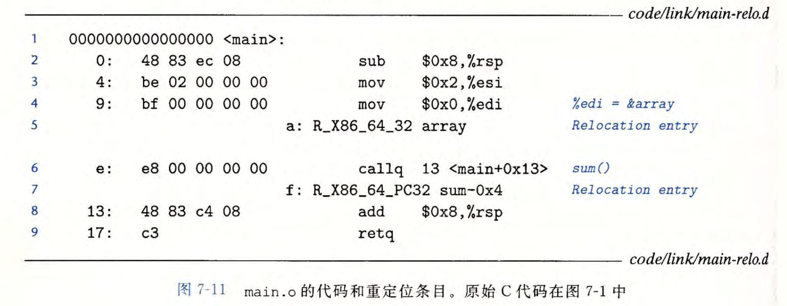  
这是反汇编产生的代码，按照算法重定位后产生  
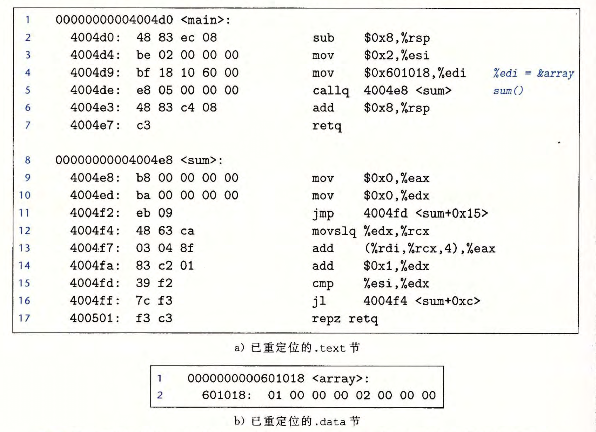

#### 可执行目标文件

典型的ELF可执行目标文件  
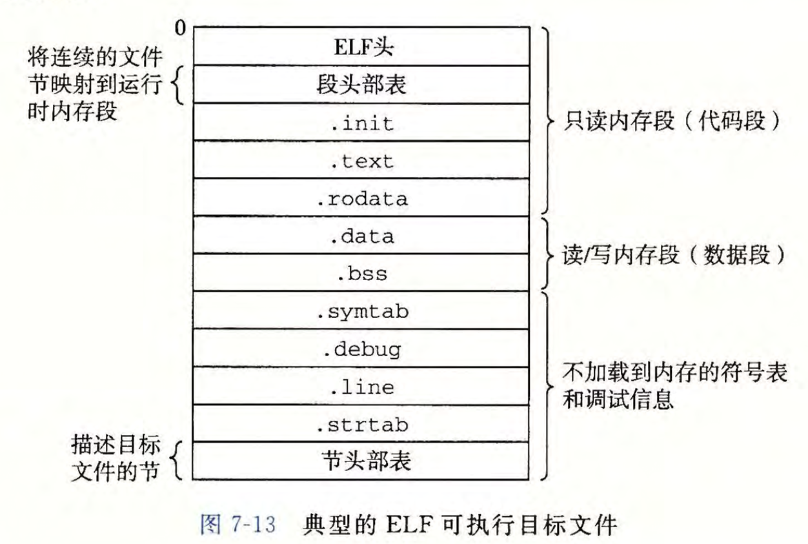  
C程序一开始是一组ASCII文本文件，现在已经被转化为一个二进制文件（包含加载程序到内存中并运行它所需的所有信息）。

ELF头——>描述文件的总体格式，还包括程序的入口点（entry point）。  
.text、.rodata和.data节于可重定位目标文件中的节是相似的，不过这些节已经被重定位到它们最终的运行时内存地址。  
注意还分为了代码段，数据段。  
.init节定义了一个小函数，叫做_init，程序的初始化代码需要调用它。  
可执行文件是完全链接的（已被重定位），不再需要rel节。  
程序头部表描述了可执行文件的连续的片(chunk)被映射到连续的内存段中的映射关系。  
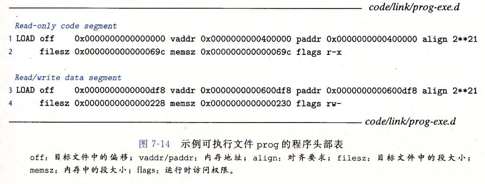  
`r-x` 读/执行访问权限。  
`rw-` 读/写访问权限  
`off`目标文件中的偏移。  
`vaddr/paddr` 内存地址  
`align` 对齐要求  
`filesz` 目标文件中的段大小  
`memsz` 内存中的段大小  
`flags` 运行时访问权限

考虑第一个段（代码段），它有读/执行访问权限，开始于内存地址0x400000处，总的内存大小是0x69c字节，并且被初始化为可执行目标文件的头0x69c个字节，其中包括ELF头、程序头部表以及.init、.text和.rodara节。

考虑第二个段（数据段），它有读/写访问权限，开始于内存地址0x600df8处，总的内存大小是0x230字节，并且用从目标文件中偏移0xdf8处开始的.data节中的0x228字节初始化，该段剩下的8个字节对应于运行时将被初始化未0的.bss数据。

对于任何段s，链接器必须选择一个其实地址vaddr  
使得 vaddr $mod$ align =off $mod$ align  
2\*\*21=$2^{21}$\=0x200000  
这是一个优化操作

# 7.9 加载可执行目标文件

对于可执行目标文件，可以调用某个驻留在存储器中称为加载器(loader)的操作系统代码来运行它。  
任何linux程序都可以通过调用execve函数来调用加载器。  
加载器将可执行目标文件中的代码和数据从磁盘复制到内存中，然后跳转到程序的第一条指令或入口点来运行该程序。  
程序——>复制到内存——>运行 整个过程叫做`加载`。

每个linux程序存在一个运行时内存映像。  
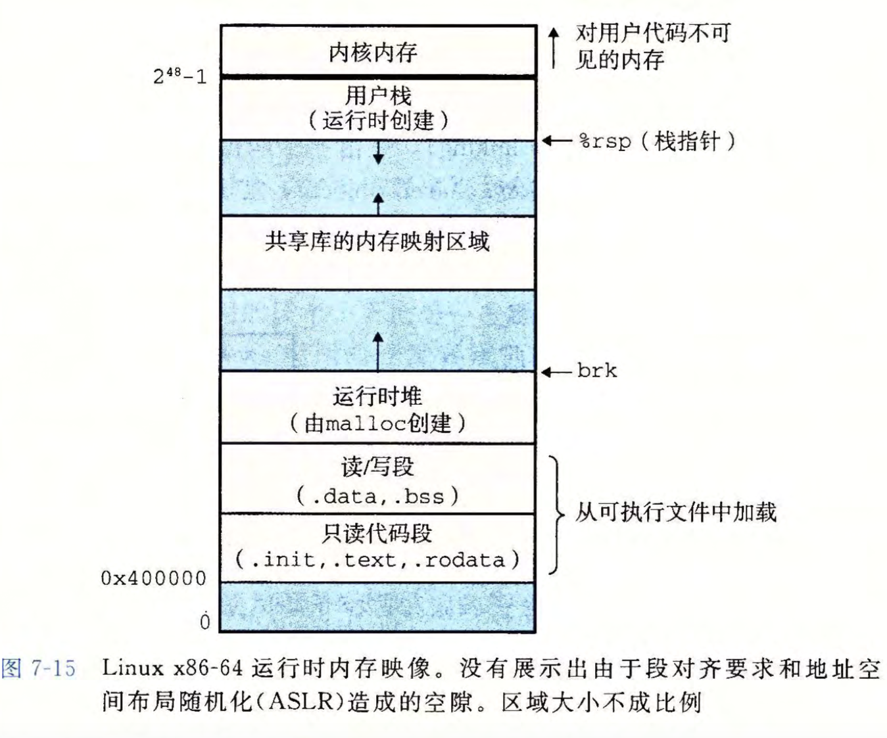  
运行时堆在数据段之后，通过调用malloc库往上增长。  
堆后面的区域为共享模块保留。  
用户栈总是从最大的合法用户地址（$2^{48}-1$）开始，向较小内存地址增长。  
从地址$2^{48}$开始，是为内核(kernel)中的代码和数据保留的。  
（内核就是操作系统驻留在内存的部分）  
.data段有对齐要求，故代码段和数据段之间是有间隙的。  
链接器会使用地址空间布局随机化(ASLR)，每次运行是地址会发生改变，但它们的相对位置是不变的。

加载器运行：  
`1`在程序头部表的引导下，加载器将可执行文件的片(chunk)复制到代码段和数据段。  
`2`加载器跳转到程序入口点`_start`函数，该函数由系统目标文件ctrl.o中定义。  
`3`\_start函数调用系统启动函数`__libc_start_main`（定义在libc.so中，用于初始化执行环境，调用用户层的main函数，处理main函数的返回值，并且在需要的时候把控制返回给内核）

# 7.10 动态链接共享库

`共享库`是一个目标模块，在运行或加载时，可以加载到任意到内存地址，并和一个在内存中的程序链接起来。  
这个过程叫做`动态链接`，由`动态链接器`程序执行。  
共享库也称为`共享目标`，在linux系统中用.so后缀标识。  
（微软操作系统中大量使用了共享库，它们称为DLL即动态链接库）

共享库的两种不同方式“共享”  
`1`任何给定的文件系统中，对于一个库有且只有一个.so文件，所有引用该库的可执行目标文件共享这个.so文件中的代码和数据，并非像静态库的内容那样被复制和嵌入到引用它们的可执行文件中。  
`2`在内存中，一个共享库的.text节的一个副本可以被不同的正在运行的进程共享。  
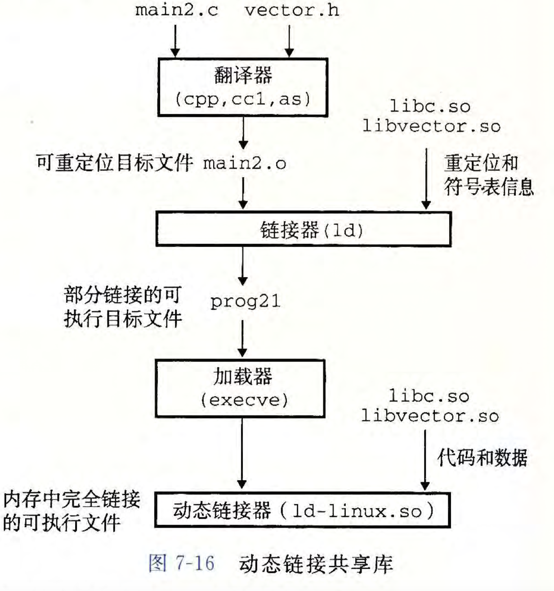  
如何创建共享库？

```shell
linux> gcc -shared -fpic -o libvector.so addvec.c multvec.c
```

`-fpic` 让编译器生成与位置无关的代码  
`-shared` 指示链接器创建一个共享的目标文件  
如何链接动态共享库？

```shell
linux> gcc -o prog21 main2.c ./libvector.so
```

创建可执行文件时，静态执行一些链接，然后再程序加载时，动态完成链接过程。  
此时，没有任何libvector.so的代码和数据结真的被复制到prog21中，只复制了一些重定位和符号表信息，使得运行时可以解析对libvector.so中代码和数据的引用。  
此时生成的prog21是部分链接的可执行目标文件。  
加载器加载和运行可执行文件prog21时，它发现prog21中包含一个`.interp`节，该节包含动态链接器的路径名，动态链接器本身就是一个共享目标。（如在linux系统上就是ld-linux.so）  
所以加载器不像往常那样把控制传递给应用，而是加载和运行动态链接器，然后动态链接器执行重定位：  
`1`重定位共享库的文本和数据到不同的内存段（可能有多个共享库）  
`2`重定位prog21中对共享库定义的符号的引用。  
最后，动态链接器才会把控制传递给应用程序，此时，共享库的位置就固定了，而且在程序执行的过程中不会改变。

# 7.11 从应用程序中加载和链接共享库

应用程序还可能在运行时要求动态链接器加载和链接某个共享库，而无需在编译时将那些库链接到应用中。  
应用:`1`分发软件;`2`构建高性能Web服务器  
在Linux系统中，为动态链接器提供了一个简单的借口，允许应用程序在运行时加载和链接共享库。

```c
#include <dlfcn.h>

void *dlopen(const char *filename, int flag)
// 返回：若成功则为指向句柄的指针，若出错则为NULL
```

dlopen函数加载和链接共享库filename。用已用带RTLD_GLOBAL选项打开了的库解析filename中的外部符号。  
若当前可执行文件是带-rdynamic选项编译的，那么对符号解析而言，全局符号也可以用。  
flag参数：  
`RTLD_NOW` 链接器立即解析对外部符号的引用。  
`RTLD_LAZY` 链接器推迟符号解析直到执行来自库中的代码。  
两值中任意一个可与`RTLD_GLOBAL`标志取或。

```c
#include <dlfcn.h>
void *dlsym(void *handle,char *symbol)
//若成功则为指向符号的指针，若出错则为NULL
```

输入dlsym函数的是一个指向前面已经打开了的共享库的句柄和一个symbol名字，若该符号存在，则返回符号的地址，否则返回NULL。

```c
#include <dlfcn.h>
int dlclose(void *handle);
//若成功则返回0，出错则返回-1
```

此时，若没有其他共享库还在使用这个共享库，则disclose函数卸载该共享库。

```c
#include <dlfcn.h>
const char *dlerror(void);
//若前面对dlopen、dlsym或dlclose的调用失败，则返回错误信息（以字符串的形式）；若前面的调用成功，则返回NULL。
```

如何使用这些呢？

```shell
linux> gcc -rdynamic -o prog2r dll.c -ldl
```

比如我先创建一个函数指针，然后利用dlopen去打开一个共享库，然后再利用返回的句柄传入dlsym中，获取我想要的symbol（可以是一个函数），并赋值给函数指针，接着，我像正常地用函数那样使用这个函数指针即可。

当然，真正的程序中还需要一些判断，和错误发生时的检测以保证程序的行为安全。

# 7.12 位置无关代码

可以加载而无需重定位的代码称为`位置无关代码`,PIC。对GCC使用-fpic选项可以指示GNU编译系统生成PIC代码。而共享库的编译必须总是使用该选项。

在x86-64系统中，对同一个目标模块中符号的引用是不需要特殊处理使之成为PIC的，可以用PC相对寻址来编译这些引用，构造目标文件时由静态链接器重定位。

#### PIC数据引用

原理：在内存中任何一个位置加载目标模块（包括共享目标模块），数据段与代码段的距离总是保持不变，因此，代码段中任何指令和数据段中任何变量之间的距离都是一个运行时常量，与代码段和数据段的绝对内存位置是无关的。

编译器（想要生成对全局变量的PIC引用）在数据段开始的地方创建了一个表，叫做`全局偏移量表`（Global Offset Table, GOT）。

`GOT`中，每个被这个目标模块引用的全局数据目标（过程或全局变量）都有一个8字节条目，编译器还为GOT每个条目生成一个重定位记录。  
加载时，动态链接器会重定位GOT中的每个条目，使得它包含目标的正确的绝对地址。  
每个引用全局目标的目标模块都有自己的GOT。  
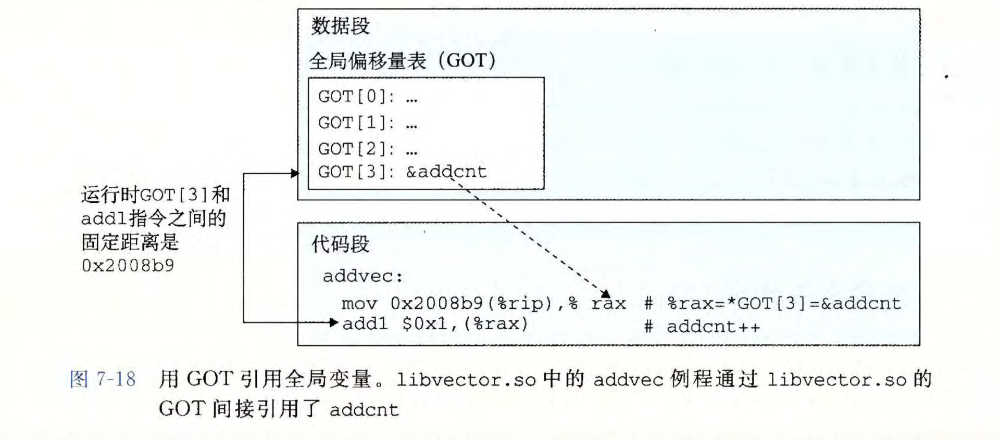  
统一：不管是自己模块定义的还是由另一个共享模块定义的，都使用GOT进行访问。

#### PIC函数调用

`延迟绑定`(lazy binding)，将过程地址的绑定推迟到第一次调用该过程时。  
例如，像libc.so这样的共享库输出的成百上千个函数中，一个典型的应用程序只会使用其中很少的一部分。把函数地址的解析推迟到它实际被调用的地方，能避免动态链接器在加载时进行成败上千个其实并不需要的重定位。  
第一次调用过程的运行时开销很大，但是其后的每次调用都只会花费一条指令和一个间接的内存引用。

`延迟绑定`由两个数据结构交互实现：`GOT`和`过程链接表（PLT）`。

如果一个目标模块调用定义在共享库中对任何函数，那么它就有自己的GOT（数据段的一部分）和PLT（代码段的一部分）  
  
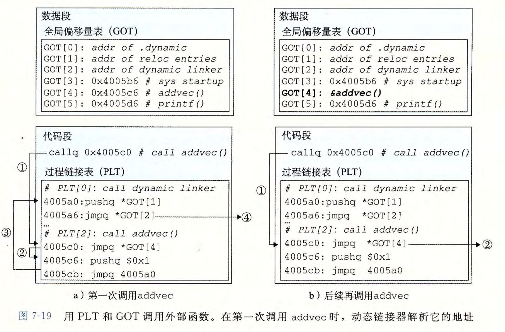  
addvec被第一次调用时，延迟解析运行时地址：  
`1`不直接调用addvec，程序调用进入PLT\[2\]（addvec的PLT条目）  
`2`第一条PLT指令通过GOT\[4\]进行间接跳转。  
每个GOT条目初始时都指向它对于的PLT条目的第二条指令。  
故这个跳转只是简单地把控制传送回PLT\[2\]中的下一条指令。  
`3`把addvec的ID（0x1）压入栈中，PLT\[2\]跳转到PLT\[0\]（动态链接器）  
`4`PLT\[0\]通过GOT\[1\]间接地把动态链接器的一个参数压入栈中，通过GOT\[2\]间接跳转进动态链接器中。  
动态链接器使用两个栈条目确定addvec的运行时位置，重写GOT\[4\]，再把控制传递给addvec。  
之后addvec再被调用时:  
`1`控制传递到PLT\[2\]。  
`2`不过这次通过GOT\[4\]的间接跳转会将控制直接转移到addvec。

# 库打桩机制

库打桩就是截获你对共享库函数的调用，取而代之执行自己的代码。

给定一个需要打桩的目标函数，创建一个包装函数（原型与目标函数完全一样）。使用打桩机制，欺骗系统调用包装函数而不是目标函数，包装函数会执行自己的逻辑，然后调用目标函数，最后将目标函数的返回值传递给调用者。

打桩可以发生在编译时、链接时或当程序被加载和执行的运行时。

`1` `编译时打桩`

```shell
linux> gcc -DCOMPILETIME -c mymalloc.c
linux> gcc -I. -o intc int.c mymalloc.o
```

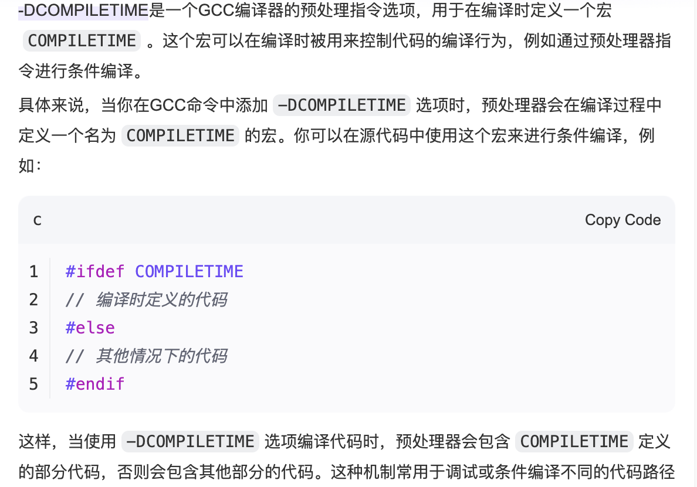

`-I.`参数告诉C预处理器在搜索通常的系统目录之前，先在当前目录中查找malloc.h(其实就是自己定义的那部分用来打桩的头文件)

```c
// int.c
#include <stdio.h>
#include <malloc.h>

int main(){
    int *p = malloc(32);
    free(p);
    return 0;
}
```

```c
// 本地自己定义的 malloc.h
#define malloc(size) mymalloc(size)
#define free(ptr) myfree(ptr)

void *mymalloc(size_t size);
void myfree(void *ptr);
```

```c
//mymalloc.c中的包装函数

#ifdef COMPLIETIME
#include <stdio.h>
#include <malloc.h>

/* malloc wrapper function */
void *mymalloc(size_t size){
    void *ptr = malloc(size);
    printf("malloc(%d)=%p\n",(int)size,ptr);
    return ptr;
}

/* free wrapper function */
void myfree(void *ptr){
    free(ptr);
    printf("free(%p)\n",ptr);
}
#endif
```

`2` `链接时打桩`  
标志--wrap f标志告诉链接器把对`f`对引用解析成`__wrap_f`（前缀是两个下划线）同时把对符号`__real_f`（注意前缀是两个下划线）对引用解析为`f`。  
在这里我们的shell命令应该如下:

```shell
//将源文件编译陈重定位目标文件
linux> gcc -DLINKTIME -c mymalloc.c
linux> gcc -c int.c
//把目标文件链接成可执行文件
linux> gcc -Wl,--wrap,malloc -Wl,--wrap,free -o intl int.o mymalloc.o
```

在这里，`-Wl,option`标志把option传递给链接器，同时option中的每个逗号都要替换为一个空格，故-Wl,--wrap,malloc就把--wrap malloc传递给链接器，以类似的方式传递-Wl,--wrap,free

```c
//mymalloc.c
#ifdef LINKTIME
#include <stdio.h>

void *__real_malloc(size_t size);
void __real_free(void *ptr);

// malloc wrapper function
void *__wrap_malloc(size_t size){
    void *ptr = __real_malloc(size);
    printf("malloc(%d) = %p\n",(int)size, ptr);
    return ptr;
}

// free wrapper function
void __wrap_free(void* ptr){
    __real_free(ptr);
    printf("free(%p)\n", ptr);
}
#endif
```

`3` `运行时打桩`  
编译时打桩需要能够访问程序的源代码，链接时打桩需要能够访问程序的可重定位对象文件。

而运行时打桩只需要能够访问可执行目标文件。  
该机制基于动态链接器的`LD_PRELOAD`环境变量。

若该环境变量被设置为一个共享库路径名的列表（以空额或分号分隔），则加载和执行一个程序，需要解析未定义的引用时，动态链接器（LD-LINUX.SO）会先搜索LD_PRELOAD库，然后才搜索任何其他的库。

当加载和执行任意可执行文件时，可以对任何共享库中对函数打桩，包括libc.so。

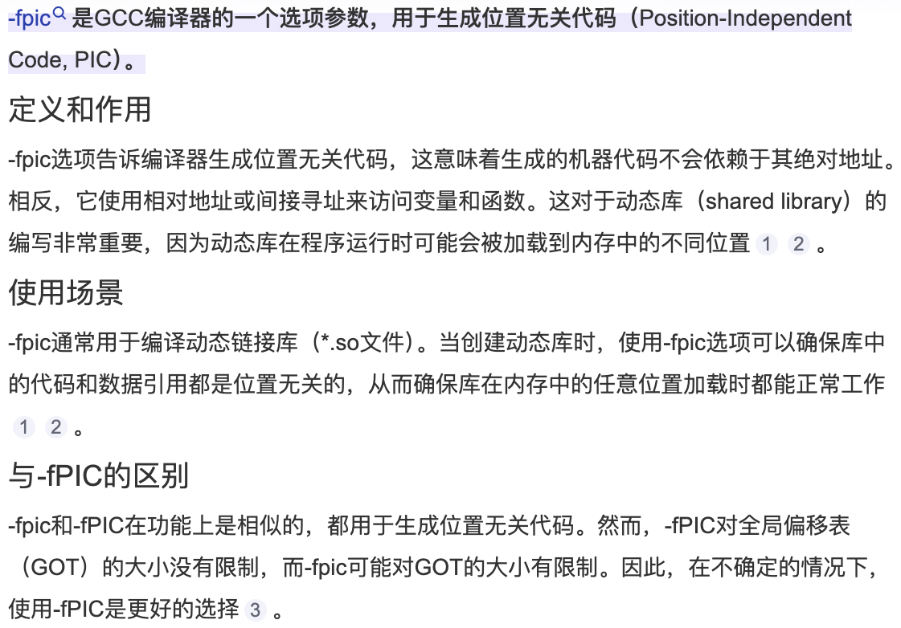

```shell
linux> gcc -DRUNTIME -shared -fpic -o mymalloc.so mymalloc.c -ldl
linux> gcc -o intr int.c
```

```c
#ifdef RUNTIME
#define _GNU_SOURCE
#include <stdio.h>
#include <stdlib.h>
#include <dlfcn.h>


// malloc wrapper function
void *malloc(size_t size){
    void *(*mallocp)(size_t size);
    char *error;
    mallocp = dlsym(RTLD_NEXT, "malloc"); // 得到libc 中malloc的地址
    if((error = dlerror()) != NULL){
        fputs(error,stderr);
        exit(1);
    }
    char *ptr = mallocp(size);
    printf("malloc(%d) = %p\n",(int)size, ptr);
    return ptr;
}

//free wrapper function
void free(void *ptr){
    void (*freep)(void *) = NULL;
    char *error;
    if (!ptr) return;
    freep = dlsym(RTLD_NEXT, "free"); // 得到free函数的地址
    if((error = dlerror()) != NULL){
        fputs(error, stderr);
        exit(1);
    }
    freep(ptr);
    printf("free(%p)\n",ptr);
}
#endif
```

运行时

```shell
linux> LD_PRELOAD="./mymalloc.so" ./intr
```

printenv SHELL可以查看SHELL的类型。

# 7.14 工具

