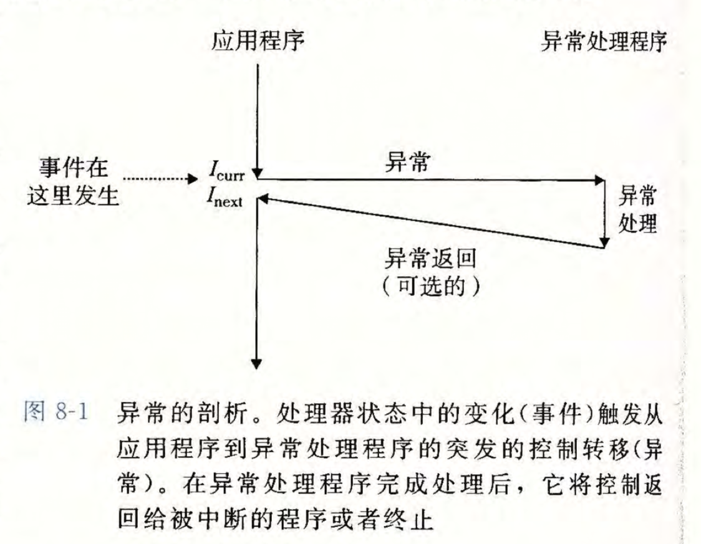
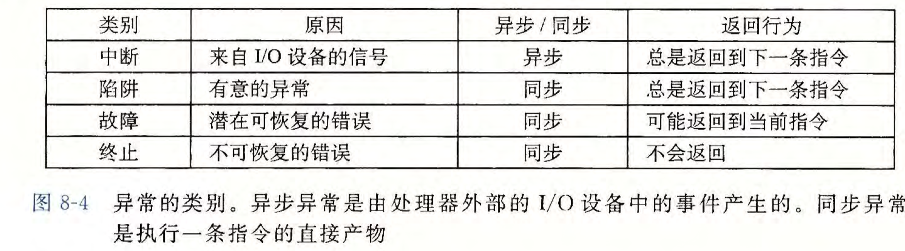
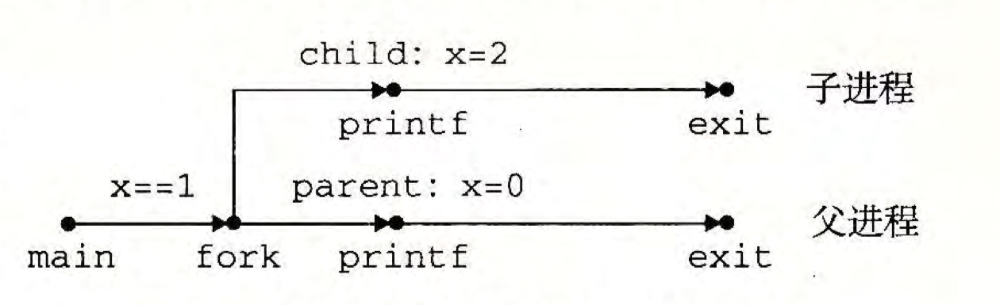
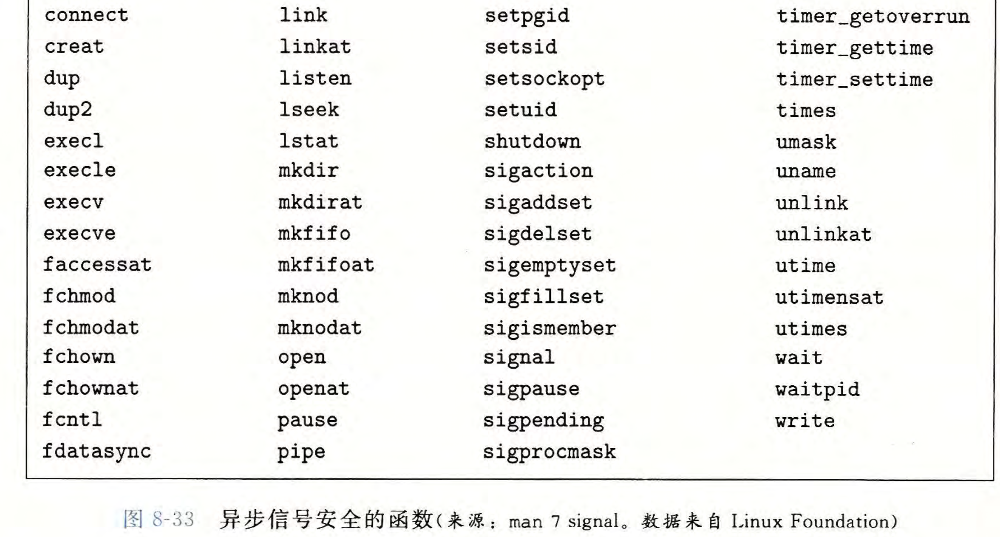
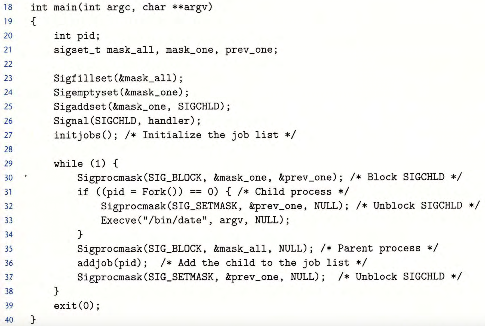

# 8.1 异常

`异常`：控制流中的突变，用来响应处理器状态中对某些变化。  
  
状态被编码为不同的位和信号，状态变化称为事件。  
事件可与当前指令执行直接相关，也可能和当前指令执行没有关系（系统定时器产生信号或I/O请求完成）。  
处理器检测到有事件发生，通过`异常表`（实际是一个跳转表），进行间接过程调用（异常），到`异常处理程序`（专门设计用来处理这类事件的操作系统子程序）。  
处理完成后，不同情况下会  
`1`控制返回$I_{curr}$（事件发生时正在执行的指令）  
`2`控制返回$I_{next}$（若未发生异常将会执行的下一条指令）  
`3`终止程序

#### 异常处理

每种类型的异常都有一个唯一非负整数异常号（exception number）。  
由处理器设计者分配:  
`被零除`、`缺页`、`内存访问违例`、`断点`以及`算术运算溢出`  
由操作系统内核（操作系统常驻内存的部分）分配：  
`系统调用`、`来自外部I/O设备的信号`

系统启动时（计算机重启或加电时），操作系统分配和初始化异常表。  


运行时（系统执行某个程序时），处理器检测到发生的事件，并确定相应异常号$k$，触发异常，执行间接过程调用，由异常表表目$k$转到相应的处理程序。  
  
异常表基址寄存器中存放了异常表的起始地址，是一个特殊的CPU寄存器。  
  
`从中断返回指令`，将适当的状态弹回到处理器的控制和数据寄存器中。若异常中断的是用户程序，则状态恢复为`用户模式`，在将控制返回给被中断程序。

#### 异常的类别

`中断(interrupt)`、`陷阱(trap)`、`故障(fault)`和`终止(abort)`  
  
其中，中断是异步的，由处理器外部的I/O设备中事件产生。  
其他同步异常是执行一条指令的直接产物，也称为故障指令。

##### 中断

  
陷阱是有意的异常，最重要的用途是在用户程序和内核之间提供一个像过程一样的接口，`系统调用`（用户程序对内核服务受控的访问，如读一个文件\[read\],创建一个新进程\[fork\],加载一个新程序\[execve\],终止当前进程\[exit\]。

##### 陷阱

  
`syscall n`是一条特殊的指令，会导致到一个异常处理程序的陷阱，处理程序解析参数，并调用适当的内核程序。  
系统调用和普通的函数调用表现一样，但实现很不一样。  
普通函数运行在`用户模式`下，限制了函数可执行的指令类型，只能访问与调用函数相同的栈。  
系统调用运行在`内核模式`下，允许系统调用执行特权指令，访问定义在内核中的栈。

##### 故障

故障由错误情况引起，可能能够被故障处理程序修正。能修复就继续，否则终止。  
  
经典的故障——缺页异常。指令引用一个虚拟地址，而与该地址相对应的物理页面不在内存中，故必须从磁盘中取出，发生故障。  
缺页处理程序从磁盘加载适当的页面，再将控制返回给引起故障的指令，再次执行指令时，相应物理页已经在内存中了。

##### 终止

终止是不可恢复的致命错误造成的结果，通常为硬件错误，如DRAM或SRAM被损坏时发生的奇偶错误。  


#### Linux/x86-64系统中的异常

有高达256种不同的异常类型。0～31的号码对应的是Intel架构师定义的异常（这部分对任何x86-64系统都是一样的）；32-255的号码对应的是操作系统定义的中断和陷阱。  


##### 除法错误（异常0）

当应用试图除以零，或当一个除法指令的结果对于目标操作数来说太大，会发生除法错误。  
Unix不会试图从除法错误中恢复，而是选择终止，Linux shell中通常把除法错误报告为`浮点异常（Floating exception）`。

##### 一般保护故障（异常13）

许多原因会导致，但通常时因为一个程序引用了一个未定义的虚拟内存区域，或者因为程序试图写一个只读文本段。  
Linux不会尝试恢复这类故障，Linux shell通常会把这种一般保护故障报告为`段故障（Segmentation fault）`。

##### 缺页（异常14）

处理程序将适当的磁盘上虚拟内存的一个页面映射到物理内存的一个页面，然后重新执行这条产生故障的指令。

##### 机器检查（异常18）

导致故障的指令执行中检测到致命的硬件错误时发生，机器检查处理程序从不返回控制给应用程序。

#### Linux/x86-64系统调用

  
每个系统调用有一个唯一的整数号，对应到内核中跳转表的偏移量（该跳转表和异常表不一样）。  
可以通过syscall陷阱指令来实现系统调用，但C语言中也有一些标准库封装了一些函数用于系统调用，它们称为`系统级函数`。  
所有到Linux系统调用的参数都是通过通用寄存器而不是栈传递的。  
%rax包含系统调用号，%rdi、%rsi、%rdx、%r10、%r8和%r9包含最多6个参数。（第一个在%rdi，第二个在%rsi...以此类推）。  
系统调用返回时，寄存器%rcx和%r11都会被破坏，%rax包含返回值。  
\-4095到-1之间的负数返回值表明发生了错误，对应于负的errno。

# 8.2 进程

进程就是一个执行中程序的实例，系统中每个程序都运行在某个进程的上下文(context)中。  
上下文是由程序正确运行所需的状态组成的。状态包括`存放在内存中的程序的代码和数据`、`它的栈`、`通用目的寄存器的内容`、`程序计数器`、`环境变量`以及`打开文件描述符`的集合。  
shell中使用可执行目标文件的名字可以运行程序，创建一个新的进程，在新进程的上下文中运行可执行目标文件。  
应用程序也能够创建新进程，在新进程的上下文中运行自己的代码或其他应用程序。  
进程提供给应用程序的关键抽象：  
`一个独立的逻辑控制流`：我们的程序好像独占地使用处理器  
`一个私有的地址空间`：我们的程序好像独占地使用内存系统

#### 逻辑控制流

  
关键在于进程是轮流使用处理器的，每个进程执行它的流的一部分，然后被抢占(preempted)（暂时挂起），然后轮到其他进程。  
对于一个运行在这些进程之一的上下文中对程序，它看上去就像是在独占地使用处理器。  
处理器的一个物理控制流被分成了三个逻辑流。每个进程一个。  
A先运行一会，然后B运行一会到结束，接着C运行一会，然后A运行直到结束，最后C运行直到结束。

##### 并发流

逻辑流有许多不同的形式，异常处理程序、进程、信号处理程序、线程和Java进程都是逻辑流。  
`并发流`：一个逻辑流的执行在时间上与另一个流重叠，两个流并发地运行。  
流X和Y相互并发当且仅当X在Y开始之后且在Y结束之前开始，或者Y在X开始之后且在X结束之前开始。  
A、B并发运行，A、C并发运行，但B、C没有并发运行。B的最后一条指令在C的第一条指令之前执行。  
多个流并发地执行的一般现象称为并发(concurrency)。  
一个进程和其他进程轮流运行的概念称为多任务(multitasking)。  
一个进程执行它的控制流的一部分的每一时间段叫做时间片(time slice)。  
多任务也叫做时间分片(time slicing)。  
A由两个时间片组成。  
`并行流(parallel flow)`是并发流的一个真子集，两个流并发地运行在不同的处理器核或者计算机上，并行地运行，并行地执行。  
并发流与流运行的处理器核数或者计算机数无关，若两个流在时间上重叠，那么它们就是并发的，即使两个流运行在同一个处理器上。

##### 私有空间地址

  
在一台n位地址的机器上，地址空间是$2^{n}$个可能地址的集合。进程为每个程序提供它自己的私有地址空间。  
和私有地址空间中某个地址相关联的那个内存字节是不能被其他进程读或者写的，所以说是私有的。  
每个私有地址空间相关联的内存的内容一般是不同的，但每个这样的空间都有相同的通用结构。  
`地址空间底部`  
这是保留给用户程序的，包括通常的代码、数据、堆和栈段。  
代码段从0x400000开始。  
`地址空间顶部`  
保留给内核（操作系统常驻内存的部分），地址空间此部分包含内核在代表进程执行指令时使用的代码、数据和栈。（比如当应用程序执行系统调用时）。

##### 用户模式和内核模式

处理器提供了一种机制，限制了一个应用可以执行的指令以及它可访问的地址空间范围。  
处理器用某个控制寄存器的一个模式位来提供这种机制，寄存器描述了进程当前享有的特权。  
设置了模式位的时候，进程就运行在内核模式中（也叫做超级用户模式）。  
一个运行在内核模式的进程可以执行指令集中的任何指令，也可以访问系统中对任何内存位置。  
若没有设置模式位，进程就在用户模式中。  
用户模式下:  
1.不允许执行特权指令（如停止处理器、改变模式位或发起一个I/O操作）  
2.不允许直接引用地址空间中内核区内的代码和数据。（会导致致命的保护故障），必须通过系统调用接口间接地访问内核代码和数据。  
一开始运行应用程序代码的进程处于用户模式中，当发送中断、故障或者陷入系统调用这样对异常中，控制传递到异常处理程序，处理器将模式改为内核模式，处理程序运行在内核模式中，当它返回到应用程序代码时，处理器再把模式从内核模式改回到用户模式。  
`/proc文件系统`允许用户模式进程访问内核数据结构的内容。CPU类型`/proc/cpuinfo`，某个特殊的进程使用的内存段`/pro/<process-id>/maps`。

##### 上下文切换

上下文切换是一个较高层形式的异常控制流，用来实现多任务。  
内核为每个进程维持一个上下文(context)。  
上下文就是内核重新启动一个被抢占的进程所需的状态，由一些对象的值组成，包括通用目的寄存器、浮点寄存器、程序计数器、用户栈、状态寄存器、内核栈和各种内核数据结构（描述地址空间的页表、包含有关当前进程信息的进程表以及包含进程已打开文件的信息的文件表）。  
调度（一种决策），进程执行的某些时刻，内核可以决定抢占当前进程，并重新开始一个先前被抢占了的进程。  
调度是由调度器代码处理的。  
若内核选择一个新的进程运行，则称内核调度了这个进程，并且这个进程会抢占当前进程，使用上下文切换机制将控制转移到新的进程。  
`1`保存当前进程的上下文；  
`2`恢复某个先前被抢占的进程被保存的上下文  
`3`将控制传递给这个新恢复的进程  
内核代表用户执行系统调用时，可能发生上下文切换，如果系统调用因为等待某个事件发生而阻塞，内核可以让当前进程休眠，切换到另一个进程。  
即使系统调用没有阻塞，内核也可以决定执行上下文切换，而不是将控制返回给调用进程。  
中断也可能引发上下文切换，所有系统都有某种产生周期性定时器中断的机制（一般每1毫秒或每10毫秒），每次发生中断内核判断当前进程已经运行足够长时间，并切换到一个新的进程。  


# 8.3 系统调用错误处理

Unix系统级函数遇到错误时，通常返回-1，并设置全局整数变量errno表示什么出错了。  
strerror函数返回一个文本串，描述了和某个errno相关联的错误。  
`错误报告函数`:

```c
void unix_error(char *msg)
{
    fprintf(stderr, "%s: %s\n",msg, strerror(errno));
    exit(0);
}
```

`错误处理包装函数`:

```c
pid_t Fork(void){
    pid_t pid;
    if((pid = fork()) < 0)
        unix_error("Fork error");
    return pid;
}
```

注意，此处的pit_t是一个typedef定义类型，表示进程id类型。

```c
typedef short pid_t;
```

pid_t就是一个short类型变量，实际表示的是内核中的进程表的索引。（当然在不同平台上可能有些是int，或long）。

# 8.4 进程控制

Unix提供了大量从C程序中操作进程的系统调用。

#### 获取进程ID

每个进程都有一个唯一的正数(非零)进程ID(PID)。getpid函数返回调用进程的PID，getppid函数返回它的父进程的PID(创建调用进程的进程)。

```c
#include <sys/types.h>
#include <unistd.h>

pid_t getpid(void);
pid_t getppid(void);

```

getpid和getppid函数返回一个类型为pid_t的整数值，在Linux系统上它在types.h中被定义为int;

#### 创建和终止进程

进程总是处于下面三种状态之一：  
`运行`: 进程要么在CPU上执行，要么在等待被执行且最终会被内核调度。  
`停止`: 进程的执行被挂起(suspended)，且不会被调度。当收到SIGSTOP、SIGTSTP、SIGTTIN或者SIGTTOU信号时，进程就停止，并且保持停止直到它收到一个SIGCONT信号，在这个时刻，进程再次开始运行。  
`终止`: 进程永远地停止了。进程终止的原因有三:1)收到一个信号，该信号的默认行为是终止进程;2) 从主程序返回;3)调用exit函数。

```c
#include <stdlib.h>

void exit(int status);
// 该函数不返回
```

exit函数以status退出状态来终止进程（另一种设置退出状态的方法是从主程序中返回一个整数值），我们设置exit(0);的话，就和我们在main程序中设置return 0;的意思差不多。

父进程通过调用fork函数创建一个新的运行的子进程。

```c
#include <sys/types.h>
#include <unistd.h>

pid_t fork(void);
// 该函数在子进程中返回0，在父进程则返回子进程的PID（是一个非负整数）；
// 如果出错了，返回-1。
```

新创建的子进程得到与父进程用户级虚拟地址空间相同（但是独立的）一份副本，包括代码和数据段、堆、共享库以及用户栈。  
子进程还获得与父进程任何打开文件描述符相同的副本，当父进程调用fork时，子进程可以读写父进程中打开的任何文件（比如stdout)。  
父进程和新创建的子进程之间最大区别在于它们有不同的PID。  
fork函数只被调用一次，但是会返回两次，一次在调用进程（父进程中），一次是在新创建的子进程中（注意这是函数的返回值返回两次，而且结果不一样，没出错的情况下，在子进程中返回0，在父进程中返回子进程的PID——一定是正数，可以用这个来区分代码的不同逻辑流）。  
eg:

```c
int main()
{
    pid_t pid;
    int x = 1;

    pid = Fork();
    if (pid == 0){ /* Child */
        printf("child : x=%d\n",++x);
    }
    
    /* Parent */
    printf("parent: x=%d\n",--x);
    exit(0);
}
```

程序的输出为

```shell
parent: x=0
child : x=2
```

`1`: 调用一次，返回两次。一次是返回到父进程，一次是返回到新创建的子进程。  
`2`: 并发执行。父进程和子进程是并发运行的独立进程。内核能够以任意方式交替执行它们逻辑控制流中的指令。决不能对不同进程中指令的交替执行做任何假设。  
`3`: 相同但是独立的地址空间。在fork函数在父进程和子进程中返回后立即暂停这两个进程，可以看到两个进程的地址空间都是相同的。  
每个进程有相同的用户栈、相同的本地变量值、相同的堆、相同的全局变量值、以及相同的代码。父进程和子进程是独立的进程，都有自己私有的地址空间，对两个人都有的相同本地变量所做的任何改变都是独立的，不会反映在另一个进程的内存中。  
`4`: 共享文件。子进程继承了父进程所有的打开文件，在例子中，父进程调用fork时，stdout文件是打开的，并指向屏幕。子进程继承了这个文件，故它的输出也是指向屏幕的。

进程图是刻画程序语句偏序的一种简单前趋图。  


对于运行在单处理器上的程序，对应进程图中所有顶点的拓扑排序(topological sort)表示程序中语句的一个可行的全序排列。  
给定进程图中顶点的一个排列，把顶点序列从左到右写成一行，然后画出每条有向边。排序是一个拓扑排序，当且仅当画出的每条边的方向都是从左往右的。  
  
再来一个例子：  
  
在这里，子进程输出了

```c
p1: x=2
p2: x=1
```

而父进程只输出了

```c
p2: x=0
```

#### 回收子进程

当一个进程由于某种原因终止时，内核并不是立即把它从系统中清除，而是被保持在一种已终止的状态中，直到被它的父进程回收(reaped)。  
当父进程回收已终止的子进程时，内核将子进程的退出状态（也就是子进程的return的值，或者是exit函数调用时传入的参数）传递给父进程，然后抛弃已终止的进程，此时开始该进程就不存在了。  
一个终止了但还未被回收的进程称为僵死进程(zombie)。

  
  
  


如果一个父进程终止了，内核会安排init进程成为它的孤儿进程的养父。init进程的PID为1，是在系统启动时由内核创建的，它不会终止，是所有进程的祖先。

长时间运行的程序，比如shell或者服务器，总是应该回收它们的僵死子进程，即使僵死子进程没有运行，它们仍然消耗系统的内存资源。

一个进程可以通过调用waipid函数来等待它的子进程终止或者停止。

```c
#include <sys/types.h>
#include <sys/wait.h>

pid_t waitpid(pid_t pid, int *statusp, int options);
//若成功，则返回子进程的PID，若WNOHANG，则为0，如果其他错误，则为-1

```

默认情况下(options=0时)，waitpid挂起调用进程的执行，直到它的等待集合(wait set)中的一个子进程终止。如果等待集合中的一个进程在刚调用的时刻就已经终止了，那么waitpid就立即返回。这两种情况下waipid返回导致waitpid返回的已终止子进程的PID。此时，已终止的子进程已经被回收，内核会从系统中删除掉它对所有痕迹。

##### 1.等待集合成员判定

等待集合的成员是由参数pid来确定的。若pid>0，则等待集合就是一个单独的子进程，它的进程ID等于pid。若pid=-1，那么等待集合就是由父进程的所有子进程组成的。

##### 2.修改默认行为

通过将options设置为常量WNOHANG、WUNTRACED和WCONTINUED的各种组合来修改默认行为。  
`WNOHANG`: 如果等待集合中对任何子进程都还没有终止，那么就立即返回（此时返回值为0）。  
默认的行为是挂起调用进程，直到有子进程终止，在等待子进程终止的同时，如果还想做些有用的工作，这个选项会有用。  
`WUNTRACED`: 挂起调用进程的执行，直到等待集合中对一个进程变成已终止或者被停止。返回的PID为导致返回的已终止或被停止子进程的PID。  
默认的行为是只返回已终止的子进程，当你想要检查已终止和被停止的子进程时，这个选项会有作用。  
`WCONTINUED`: 挂起调用进程的执行，直到等待集合中一个正在运行的进程终止或等待集合中一个被停止的进程收到SIGCONT信号重新开始执行。  
可用或运算把这些选项组合起来:  
`WNOHANG | WUNTRACED`: 立即返回，如果等待集合中对子进程都没有被停止或终止，则返回值为0，如果有一个停止或终止，则返回值为该子进程的PID。

##### 3.检查已回收子进程的退出状态

如果statusp的参数非空，那么waitpid会在status中放上关于导致返回的子进程的状态信息，status是statusp指向的值。  
`WIFEXITED(status)`: 如果子进程通过调用exit或者一个返回(return)正常终止，就返回真。  
`WEXITSTATUS(status)`: 返回一个正常终止的子进程的退出状态。  
只有在WIFEXITED()返回为真时，才会定义这个状态。

`WIFSIGNALED(status)`: 如果子进程是因为一个未被捕获的信号终止的，那么就返回真。  
`WTERMSIG(status)`: 返回导致子进程终止的信号的编号。  
只有在WIFSIGNALED()返回为真时，才会定义这个状态。

`WIFSTOPPED(status)`: 如果引起返回的子进程当前是停止的，那么就返回真。  
`WSTOPSIG(status)`: 返回引起子进程停止的信号的编号。  
只有在WIFSTOPPED()返回为真时，才定义这个状态。

`WIFCONTINUED(status)`: 如果子进程收到SIGCONT信号重新启动，则返回真。

#### 4.错误条件

如果调用进程没有子进程，那么waitpid返回-1，并且设置errno为ECHILD。  
如果waitpid函数被一个信号中断，那么它返回-1，并且设置errno为EINTR。  
注意，这些常量一般都在某个头文件中定义了，如WNOHANG,WUNTRACED，它们被包含在wait.h。

```c
#include <sys/wait.h>
```

而ECHILD,EINTR之类的，被包含在errno.h。  
我们假定所有的这些头文件都被包含在一个称为csapp.h的头文件里。  
  
  
注意，中间的一段中，只要满足先a后c的条件，b可以出现在任何位置。如b a c , a b c, a c b。

##### wait函数

这是waitpid函数的简单版本

```c
#include <sys/types.h>
#include <sys/wait.h>

pid_t wait(int *statusp);
```

调用wait(&status)等价于调用waitpid(-1,&status,0);

一些例子

```c
#include "csapp.h"
#define N 2

int main()
{
    int status, i;
    pid_t pid;
    /* Parent creates N children */
    for(i=0; i < N; i++)
        if((pid = Fork()) == 0)
            exit(100+i);

    /* Parent reaps N children in no particular order */
    while( (pid = waitpid(-1, &status, 0)) > 0 ){
        if(WIFEXITED(status))
            printf("child %d terminated normally with exit status=%d\n",pid, WEXITSTATUS(status));
        else
            printf("child %d terminated abnormally\n", pid);
    }
    /* The only normal termination is if there are no more children */
    if(errno != ECHILD)
        unix_error("waitpid error");
    exit(0);
}
```

这样一个程序不会按照特定的顺序回收子进程，子进程的回收的顺序是这台特定计算机系统的属性。这是一个非确定行为。  
如何变成确定性呢？

```c
#include "csapp.h"
#define N 2

int main()
{
    int status, i;
    pid_t pid[N], retpid;
    /* Parent creates N children */
    for(i=0; i < N; i++)
        if((pid[i] = Fork()) == 0)
            exit(100+i);

    /* Parent reaps N children in no particular order */
    i=0;
    while( (retpid = waitpid(pid[i++], &status, 0)) > 0 ){
        if(WIFEXITED(status))
            printf("child %d terminated normally with exit status=%d\n",retpid, WEXITSTATUS(status));
        else
            printf("child %d terminated abnormally\n", retpid);
    }
    /* The only normal termination is if there are no more children */
    if(errno != ECHILD)
        unix_error("waitpid error");
    exit(0);
}
```

这个时候就会按照创建子进程的顺序来回收这些僵死的子进程了。  
  


#### 让进程休眠

sleep函数将一个进程挂起一段指定的时间。

```c
#include <unistd.h>

unsigned int sleep(unsigned int secs);

//返回的是还要休眠的秒数
```

若请求的时间量已经到了，则sleep返回0，否则返回还剩下的要休眠的描述。  
第二种情况下，sleep函数被一个信号中断而过早地返回。

pause函数让调用函数休眠，直到该进程收到一个信号。

```c
#include <unistd.h>

int pause(void);
// 总是返回-1
```

#### 加载并运行程序

execve函数在当前进程的上下文中加载并运行一个新程序。

```c
#include <unistd.h>

int execve(const char *filename, const char *argv[], const char *envp[]);
// 如果成功则不返回，如果错误则返回-1；
```

execve函数加载并运行可执行目标文件filename，且带参数列表argv和环境变量列表envp。  
当出现错误时，例如找不到filename，execve才会返回到调用程序。  
fork一次调用返回两次，而execve是调用一次并从不返回。  
  
参数列表有自己独特的数据结构。  
argv变量指向一个以null结尾的指针数组，其中每个指针都指向一个参数字符串。argv\[0\]是可执行目标文件的名字。  
envp变量指向一个以null结尾的指针数组，其中每个指针指向一个环境变量字符串，每个串都是形如"name=value"的名字-值对。

在execve加载了filename之后，它调用加载器，设置栈，并将控制传递给新程序的主函数，主函数原型如下：

```c
int main(int argc, char **argv, char **envp);
```

或者等价的

```c
int main(int argc, char *argv[], char *envp);
```

  
首先是参数和环境字符串，往上是紧随其后的以null结尾的指针数组，其中每个指针都指向栈中对一个环境变量字符串。  
全局变量environ指向这些指针中对第一个envp\[0\]。

在环境变量数组之后的是以null结尾的argv\[\]数组，其中每个元素都指向栈中对一个参数字符串。

栈的底部是系统启动函数libc_start_main。

main函数的三个参数：  
`1`: argc, 给出argv\[\]数组中非空指针的数量。  
`2`: argv, 指向argv\[\]数组中的第一个条目  
`3`: envp, 指向envp\[\]数组中对第一个条目

对于环境数组，还有一些函数可以操作:

```c
#include <stdlib.h>

char *getenv(const char *name);
//若存在则为指向name对指针，若无匹配的则为NULL。
```

getenv函数在环境数组中搜索字符串"name=value"，如果找到了就返回一个指向value的指针，否则返回NULL。

```c
#include <stdlib.h>

int setenv(const char *name, const char *newvalue, int overwrite);
//若成功则返回0，若错误则返回-1

void unsetenv(const char *name);
//不进行返回
```

若环境数组包含一个"name=oldvalue"的字符串，那么unsetenv会删除它，而setenv会用newvalue代替oldvalue（overwrite要非零）。若name不存在，则setenv会把"name=newvalue"添加到数组当中。

##### 程序与进程的区别

程序是一堆代码和数据，程序可以作为目标文件存在于磁盘上，或者作为段存在于地址空间中。

进程是执行中程序的一个具体的实例，程序总是运行在某个进程的上下文中。

fork函数在新的子进程中运行相同的程序，新的子进程是父进程的一个复制品。

execve函数在当前进程的上下文中加载并运行一个新的程序。它会覆盖当前进程的地址空间，但并没有创建一个新进程。新的程序仍然有相同的PID，并且继承了调用execve函数时已打开的所有文件描述符。

#### 利用fork和execve运行程序

简单shell的main例程。shell打印一个命令行提示符，等待用户在stdin上输入命令行，然后对这个命令行求值。

```c
#include "csapp.h"
#define MAXARGS 128
/* Function prototypes */
void eval(char *cmdline);
int parseline(char *buf, char **argv);
int builtin_command(char **argv);

int main(){
    char cmdline[MAXLINE];/* Command line */

    while(1){
        /* Read */
        printf("> ");
        Fgets(cmdline,MAXLINE, stdin);
        if(feof(stdin))
            exit(0);

        /* Evaluate */
        eval(cmdline);
    }
}
```

首要任务调用了parseline函数，该函数解析了以空格分隔的命令行参数，并构造最终传递给execve的argv向量。  
第一隔参数被假设为要么是一个内置的shell命令名，马上就会解释这个命令，要么是一个可执行目标文件，会再一个新的子进程的上下文中加载并运行这个文件。  
如果最后一个参数是"&"字符，那么parseline返回1，表示应该再后台执行该程序(shell不会等待它完成)。否则，返回0，表示应该在前台执行这个程序（shel在此时会等待它完成）。  
解析完命令行后，eval函数调用builtin_command函数，该函数检查第一个命令行参数是否是一个内置的shell命令，如果是就立即解释这个命令，返回1，否则返回0.简单的shell只有一个内置命令——quit，该命令终止shell。（实际的shell有大量命令，如pwd、jobs和fg）。  
如果builtin_command返回0，则shell创建一个子进程，并在子进程中执行所请求的程序。

若用户要求在后台运行该程序，则shell返回到循环的顶部，等待下一个命令行，否则shell使用waitpid函数等待作业终止，当作业终止时，shell才开始下一轮的迭代。

```c
/* eval -Evaluate a command line */
void eval(char *cmdline)
{
    char *argv[MAXARGS]; // Argument list execve()
    char buf[MAXLINE]; // Holds modified command line
    int bg;// Should the job run in bg or fg? Backgrond, Frontground。
    pid_t pid;// Process id

    strcpy(buf,cmdline);
    bg = parseline(buf, argv);
    if(argv[0] == NULL) return; // ignore empty lines
    if(!builtin_command(argv)){
        if((pid = Fork()) == 0){
            if(execve(argv[0],argv,environ)<0){
                printf("%s: Command not found./n",argv[0]);
                exit(0);
            }
        }
    }

    /* Parent waits for foreground job to terminate */
    if(!bg){
        int status;
        if(waitpid(pid,&status,0)<0)
            unix_error("waitfg: waitpid error");
    }
    else
        printf("%d %s",pid,cmdline);
    return;
}
```

```c
/* If first arg is a builtin command, run it and return true */
int builtin_command(char **argv){
    if(!strcomp(argv[0],"quit"))
        exit(0);
    if(!strcmp(argv[0],"&"))
        return 1;
    return 0;
}
```

```c
/* parseline -Parse the command line and build the argv array */
int parseline(char *buf, char **argv){
    char *delim; /*Points to first space delimiter */
    int argc; /* Number of args */
    int bg;	/* Background job? */

    buf[strlen(buf)-1] = ' '; /* Replace trailing '\n' with space */
    while(*buf ** (*buf == ' ')) buf++;

    /* Build the argv list */
    argc = 0;
    while((delim = strchr(buf, ' '))){
        argv[argc++] = buf;
        *delim = '\0';
        buf = delim +1;
        while(*buf && (*buf == ' ')) buf++;
        // Ignore spaces
    }
    argv[argc] = NULL;

    if(argc == 0) return 1;

    /*Should the job run in the background? */
    if((bg = (*argv[argc-1] == '&')) != 0)
        argv[--argc]= NULL;
    return bg;
}
```

目前来说，这个简单的shell存在缺陷，因为它并不回收它的后台子进程，修改此缺陷要求使用信号。

# 8.5 信号

  
  
  
signal(SIGCHLD, handler1) 成功执行后，操作系统将会将所有 SIGCHLD 信号自动路由到 handler1。  
Linux信号：允许进程和内核中断其他进程。  
一个信号就是一条小消息，它通知进程系统中发生了一个某种类型的事件。  
  
每种信号类型对应于某种系统事件。低层的硬件异常是由内核异常处理程序处理的，正常情况下对用户进程而言是不可见的。信号提供了一种机制，通知用户进程发生了这些异常。

内核是信号的主要发送者，负责处理硬件异常、系统事件和资源限制等情况。用户进程也可以通过kill()、raise()等系统调用发送信号。

比如，如果一个进程试图除以0，那么内核就发送给它一个SIGFPE信号（号码8）。一个进程可以通过向另一个进程发送一个SIGKILL信号（号码9）强制终止它。当一个子进程终止或者停止时，内核会发送1一个SIGCHLD信号（号码17）给父进程。  


#### 信号术语

传送一个信号到目的进程是由两个不同步骤组成的：发送信号和接收信号。  
`发送信号`: 内核通过更新目的进程上下文中的某个状态，发送（递送）一个信号给目的进程。  
有两种原因会导致发送信号。  
1)内核检测到一个系统事件，比如除零错误或者子进程终止。  
2)一个进程调用了kill函数，显式地要求内核发送一个信号到目的进程。一个进程可以发送信号给它自己。

`接收信号`:当目的进程被内核强迫以某种方式对信号的发送做出反应时，它就接收了信号。  
进程可以忽略这个信号，终止或者通过信号处理程序（signal handler）（一个用户层函数）捕获这个信号。  


一个发出但没有被接收的信号叫做待处理信号(pending signal)。在任何时刻，一种类型至多只会有一个待处理信号。如果一个进程有一个类型为k的待处理信号，那么任何接下来发送到这个进程的类型为k的信号都不会排队等待而是被简单地丢弃。

一个进程可以有选择性地阻塞接收某种信号。当一种信号被阻塞时，它仍可以被发送，但是产生的待处理信号不会被接收，直到进程取消对这种信号的阻塞。

一个待处理信号最多只能被接收一次。内核为每个进程在pending位向量中维护着待处理信号到集合，而在blocked位向量中维护着被阻塞的信号集合。

只要传送了一个类型为k的信号，内核就会设置pending中对第k位，而只要接收了一个类型为k的信号，内核就会清除pending中的第k位。

#### 发送信号

Unix系统中有大量向进程发送信号到机制，所有这些机制都基于进程组这个概念。

每个进程都只属于一个进程组，进程组由一个正整数进程组ID来标识。getpgrp函数返回当前进程的进程组ID。

```c
#include <unistd.h>

pid_t getpgrp(void);
// 返回值为调用进程的进程组ID
```

子进程和父进程在默认情况下同属于一个进程组。一个进程可以通过使用setpgid函数来改变自己或者其他进程的进程组。

```c
#include <unistd.h>

int setpgid(pid_t pid, pid_t pgid);
//若成功则返回0，错误则返回-1
```

setpgid函数将进程pid的进程组改为pgid。如果pid是0，则使用当前进程组PID。如果pgid是0，那么就用pid指定的进程的PID作为进程组ID。

若进程15213为调用进程，则setpgid(0,0);会创建一个新的进程组，进程组ID为15213，并把进程15213加入到这个进程组中。

`/bin/kill程序发送信号`

```shell
linux> /bin/kill 9 15213
```

发送信号9(SIGKILL)给进程15213。

一个为负的PID会导致信号被发送到进程组PID中对每个进程。

```c
linux> /bin/kill -9 15213
```

发送一个SIGKILL信号给进程组15213中的每个进程。

`从键盘发送信号`  
Unix Shell使用作业(job)来表示对一条命令行求值而创建的进程，在任何时刻，至多只有一个前台作业和0个或多个后台作业。

```shell
linux> ls | sort
```

创建一个由两个进程组成的前台作业，这两个进程通过Unix管道连接起来。  
进程组ID通常取自作业中父进程中的一个。  
  
键盘上输入Ctrl + C会导致内核发送一个SIGINT信号到前台进程组中的每个进程。默认情况下终止前台作业。  
输入Ctrl+Z会发送一个SIGTSTP信号到前台进程组中的每个进程。默认情况下是停止（挂起）前台作业。

`用kill函数发送信号`

```c
#include <sys/types.h>
#include <signal.h>

int kill(pid_t pid, int sig);
// 若成功则返回0，若错误则为-1
```

如果pid大于零，那么kill函数发送信号号码sig给进程pid。

如果pid等于零，那么kill发送信号sig给调用进程所在进程组中的每个进程，包括调用进程自己。

如果pid小于零，kill发送信号sig给进程组|pid|(pid的绝对值)中的每个进程。

`用alarm函数发送信号`  
进程可以调用alarm函数向它自己发送SIGALRM信号。

```c
#include <unistd.h>

unsigned int alarm(unsigned int secs);
// 返回前一次闹钟剩余的秒数，若以前没有设定闹钟，则为0
```

alarm函数安排内核在secs秒后发送一个SIGALRM信号给调用进程，如果secs是0，那么不会调度安排闹钟(alarm)。  
任何情况下，对alarm的调用都将取消任何待处理的(pending)闹钟，并且返回任何待处理的闹钟在被发送前还剩下的秒数（如果这次对alarm的调用没有取消它的话，它将在多少秒后发送SIGALRM信号）；若没有任何待处理的闹钟，则返回零。

#### 接收信号

当内核把进程p从内核模式切换到用户模式时（例如，从系统调用返回或是完成了一次上下文切换），它会检查进程p的未被阻塞的待处理信号的集合(pending & ~blocked)。  
若该集合为空（通常情况下），那么内核将控制传递到p的逻辑控制流中的下一条指令($I_{next}$)。  
然而，如果集合是非空的，那么内核选择集合中对某个信号k（通常是最小的k），强制p接收信号k。  
收到这个信号触发进程采取某种行为，一旦进程完成了这个行为，控制就传递回p的逻辑控制流中对下一条指令($I_{next}$)。

不同信号类型的预定义默认行为：  
`进程终止`  
`进程终止并转储内存`  
`进程停止（挂起）直到SIGCONT信号重启`  
`进程忽略该信号`

signal函数可以修改和信号相关联的默认行为，唯一例外的是SIGSTOP和SIGKILL，这两个的默认行为是不能修改的。

```c
#include <signal.h>
typedef void (*sighandler_t)(int);

sighandler_t signal(int signum, sighandler_t handler);
// 若成功则返回指向前次处理程序的指针，若出错则为SIG_ERR(注意不会设置errno)
```

若handler为SIG_IGN，则忽略类型为signum的信号；若为SIG_DFL，则类型为signum的信号行为恢复为默认行为。否则，handler就是用户定义的信号处理程序（一个函数）的地址。只要进程接收到一个类型为signum的信号，就会调用这个程序。通过把处理程序的地址出传递到signal函数从而改变默认行为。这叫做设置信号处理程序(installing the handler)。  
调用信号处理程序被称为捕获信号，执行信号处理程序被称为处理信号。

当进程捕获一个类型为k的信号时，会调用为信号k设置的处理程序，一个整数参数被设置为k，这个参数允许同一个处理函数捕获不同类型的信号。

处理程序执行它的return语句时，控制（通常）传递回控制流中进程被信号接收中断位置处的指令。（也就是会继续执行上次导致发送这个信号的指令，除非说进程已经终止了）。


例子：SIGINT信号的接收行为被改成先输出一条语句，再终止程序。（在进程的任何地方使用exit函数都将终止进程）。

  
这个例子说明信号处理程序可以被其他信号处理程序中断。  
主程序捕获信号s，该信号中断主程序，将控制转移到处理程序S。S在运行时，程序又捕获信号t!=s，该信号中断S，控制转移到处理程序T。当T返回时，S从它被中断的地方继续执行，最后，S返回，控制传递回主程序，主程序从它被中断的地方继续执行。


#### 阻塞和解除阻塞信号
`隐式阻塞机制`：内核默认阻塞任何当前处理程序正在处理信号类型的待处理信号。
`显式阻塞机制`：应用程序可以使用sigprocmask函数和它的辅助函数，明确地阻塞和接触阻塞选定的信号。
```c
#include <signal.h>

int sigprocmask(int how, const sigset_t *set, sigset_t *oldset);
int sigemptyset(sigset_t *set);
int sigfillset(sigset_t *set);
int sigaddset(sigset_t *set, int signum);
int sigdelset(sigset_t *set, int signum);
//这些函数都是成功则返回0，出错返回-1
int sigismember(const sigset_t *set, int signum);
//如果signum是set的成员则返回1，如果不是返回0，若出错则返回-1
```
sigprocmask函数改变当前阻塞的信号集合（8.5.1节中描述的blocked位向量），具体行为依赖于how的值。
`SIG_BLOCK`: 把set中的信号添加到blocked中(blocked=blocked | set)。
`SIG_UNBLOCK`:从blocked中删除set中的信号(blocked=blocked & ~set)
`SIG_SETMASK`:block=set
如果oldset非空，则把blocked位向量之前的值保存在oldset中。
sigemptyset初始化set为空集合。
sigfillset函数把每个信号都添加到set中。
sigaddset函数把signum添加到set。
sigdelset函数从set中删除signum。
如果signum是set成员，则sigismember返回1，否则返回0.


用sigprocmask来临时阻塞接收SIGINT信号。

#### 编写信号处理程序
处理程序的几个属性使得它们很难推理分析。
1) 处理程序与主程序并发运行，共享同样的全局变量，因此可能与主程序和其他处理程序互相干扰。
2) 如何以及何时接收信号的规则常常有违人的直觉。
3) 不同的系统有不同的信号处理语义。

##### 安全的信号处理
`G0. 处理程序要尽可能简单。`避免麻烦的最好方法是保持处理程序尽可能小和简单。
例如，处理程序可能只是简单地设置全局标志并立即返回；所有与接收信号相关的处理都由主程序执行，它周期性地检查（并重置）这个标志。
`G1. 在处理程序中只调用异步信号安全的函数。`
异步信号安全的函数（或简称安全的函数）能够被信号处理程序安全的调用。
要么它是可重入的（例如只访问局部变量），要么它不能被信号处理程序中断。

Linux保证安全的系统级函数。


信号处理程序中产生输出唯一安全的方法是使用write函数，调用printf和sprintf是不安全的。
```c
#include "csapp.h"

ssize_t sio_putl(long v);
ssize_t sio_outs(char s[]);
//若成功则为传送的字节数，如果出错则为-1

void sio_error(char s[]);
//返回为空
```

sio_putl和sio_puts函数分别向标准输出传送一个long类型数和一个字符串。sio_error函数打印一条错误消息并终止。
```c
ssize_t sio_puts(char s[]) /* Put string */
{
	return write(STDOUT_FILENO, s, sio_strlen(s));
}

ssize_t sio_putl(long v)/*Put long*/
{
	char s[128];

	sio_ltoa(v,s,10);
	return sio_puts(s);
}

void sio_error(char s[]){ /* Put error message and exit*/
	sio_puts(s);
	_exit(1);
}
```
sio_strlen函数返回字符串s的长度，sio_ltoa函数把v转换为字符串表示，保存在s中。_exit函数是exit的一个异步信号安全的变种。

SIGINT处理程序的一个安全版本
```c
#inclue "csapp.h"

void sigint_handler(int sig)
{
	Sio_puts("Caught SIGINT!\n");
	_exit(0);
}
```

`G2.保存和恢复errno。`
许多linux异步信号安全函数在出错返回时都会设置errno。处理程序中调用这样对函数可能干扰主程序中其他依赖于errno的部分。
在进入处理程序之前先用一个局部变量保存errno，在处理程序返回前恢复它。
只有在处理程序要返回时才有这个必要，如果处理程序调用_exit终止该进程，那么就不需要这样做了。

`G3.阻塞所有到信号，保护对共享全局数据结构的访问。`
如果处理程序和主程序或其他处理程序共享一个全局数据结构，那么在访问（读或者写）该数据结构时，处理程序和主程序应该暂时阻塞所有到信号。
从主程序访问一个数据结构d通常需要一系列的指令，如果指令序列被访问d的处理程序中断，那么处理程序可能会发现d的状态不一致，得到不可预知的结构。在访问d时暂时阻塞信号保证了处理程序不会中断该指令序列。

`G4.用volatile声明全局变量`
考虑一个处理程序和一个main函数，共享一个全局变量g，处理程序更新g，main周期性地读g。对与一个优化编译器而言，main中g的值看起来从来没有变化过，故可能会使用缓存在寄存器中g的副本来满足对g的每次引用。如果这样，main函数可能永远都无法看到处理程序更新过的值。
用volatile类型限定符定义一个变量，告诉编译器不要缓存这个变量。
```c
volatile int g;
```
volatile限定符强迫编译器每次在代码中引用g时，都要从内存中读取g的值。

一般来说，和其他所有共享数据结构一样，应该暂时阻塞信号，保护每次对全局变量都访问。

`G5.`用sig_atomic_t声明标志。常见的处理程序设计中，处理程序会写全局标志来记录收到了信号，主程序周期性地读标志，响应信号，再清除该标志。
对于这种方式来共享的标志，C提供一种整型数据类型sig_atomic_t，对它的读和写保证会是原子的（不可中断的）。
```c
volatile sig_atomic_t flag;
```
因为是不可中断的，故可以安全地读和写sig_atomic_t变量，而不需要暂时阻塞信号。
此处原子性的保证只适用于单个的读和写，不适用于flag++或者flag=flag+10这样都更新，这可能需要多条指令。
这些规则是保守的，不总是严格必需的。

##### 正确的信号处理
pending位向量中每种类型的信号只对应有一位，故每种类型最多只能有一个未处理的信号。如果有两个类型为k的信号发送给一个目的进程，而目的进程当前正在执行信号k的处理程序，所以信号k被阻塞了，第二个信号就简单地被丢弃了，并不会排队。
故如果存在一个未处理的信号就表明至少有一个信号到达了。

不可以用信号来对其他进程中发生的事件计数。

这个程序中，由于信号不会等待，故最终三个信号的接续到达使得在第一个信号还在处理的时候第二第三个信号就已经到达了，然后第二个信号排队，第三个信号直接被丢弃。故最后第三个信号的子进程成为一个僵死进程。

怎么做出改进？

每次SIGCHLD处理程序被调用时，回收尽可能多的僵死子进程。

这里把waitpid(-1,NULL,0)的语句结构从if改为while，从而尽可能多地连续执行waitpid函数来回收终止的子进程。


这个程序的输出是213，注意fork后的子进程带走的是父进程当时的副本（包括全局变量和已经注册过的信号），在子进程里面修改是不会影响父进程的。

##### 可移植的信号处理
`signal函数的语义各有不同`，`系统调用可以被中断`

为了统一，有一个sigaction函数，允许用户在设置信号处理时，明确指定他们想要的信号处理语义。

包装函数的例子如下：

sa_mask 指定了在处理当前信号时，额外需要阻塞的其他信号。
如果 sa_mask 为空（如调用 sigemptyset 所设定的），则除了当前信号，处理期间不会额外阻塞其他信号。
如果需要阻塞特定信号（例如 SIGTERM），可以通过 sigaddset 将其添加到 sa_mask 中。
在调用信号处理函数时，内核会自动将正在处理的信号（比如 SIGINT）加入到进程的阻塞信号集（signal mask）中。

注意并发，在这个程序例子中，如果子进程比较快结束了，那么调用了handler,然后deletejob，此时由于还没有addjob，所以deletejob什么都不会干。而后面又会addjob，此时加入进来的addjob就是一个不存在的东西，程序就出bug了。

关于execve函数的补充：
execve 是 "execute a program" 的缩写，它的全称可以理解为 execute with environment。
它是一个 UNIX/Linux 系统调用，用于执行另一个程序。

execve 用于用一个新的程序替换当前进程的执行映像，也就是说，当调用 execve 时，当前进程的代码和数据会被新的程序完全覆盖，并开始运行新的程序。它不会创建新的进程，而是直接在当前进程中加载新的程序。

exec: 表示 "execute"（执行）。
v: 表示 "vector"（参数向量）。参数以字符指针数组的形式传递（类似于 argv）。
e: 表示 "environment"（环境变量）。允许传递特定的环境变量给新程序。



解决办法是我们确保addjob之后才会有deletejob，所以在调用fork创建子进程之前，先屏蔽SIGCHLD信号，避免触发handler函数处理。

##### 显式地等待信号


父进程设置SIGINT和SIGCHLD的处理程序，然后进入一个无限循环。同时阻塞SIGCHLD信号，避免父进程和子进程之间的竞争，再用Fork函数创建和调用子进程。之后把pid重置为0，然后再取消阻塞SIGCHLD（这里就是为了防止子进程更快结束导致pid被置为非零然后再置为零）。接着以循环的方式等待pid变为非零。子进程终止后，处理程序回收它，把它非零的PID赋值给全局pid变量。终止循环，父进程继续其他工作，然后开始下一次迭代。

循环有点浪费，怎么办？

两个糟糕的方案：


`sigsuspend`:


# 8.6 非本地跳转
将控制直接从一个函数转移到另一个当前正在执行的函数，而不需要经过正常的调用-返回序列。
非本地跳转通过setjump和longjmp函数提供。

longjmp 和 setjmp 的关系
`setjmp`:
保存当前的程序执行状态（包括栈、寄存器等上下文）到一个 jmp_buf 类型的变量。
第一次直接调用 setjmp 时，它返回值为 0。
如果后续通过 longjmp 恢复到这里，setjmp 将返回一个由 longjmp 的 retval 参数指定的值。

`longjmp`:
用来跳转回之前调用 setjmp 保存的执行状态。
它会导致 setjmp 返回，就像 setjmp 被重新调用了一样。
但是返回值不是 0，而是 longjmp 的 retval 参数值。

`retval`
retval 是 setjmp 的返回值：
longjmp(env, retval) 会让程序跳转到 setjmp 的位置，并使得 setjmp 返回值为 retval。
但需要注意，如果 retval 为 0，系统会自动将其调整为 1，以避免 setjmp 再次返回 0（与直接调用 setjmp 的行为区分）。
常见用法：
retval 通常用来表示发生了哪种错误或者跳转的原因。
例如，retval = 1 表示第一种错误，retval = 2 表示第二种错误。
通常用作错误码或者标识信号，帮助区分不同的跳转原因


longjmp运行它跳过所有中间调用的特性可能产生意外的后果，例如，如果中间函数调用中分配了某些数据结构，本来预期在函数结尾处释放，那么这个释放代码会被跳过，因而产生内存泄露。


# 8.7 操作进程的工具
