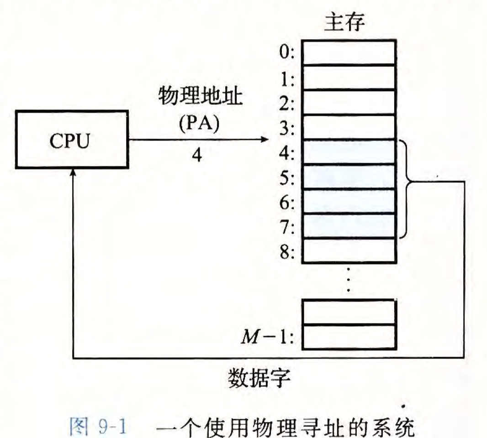
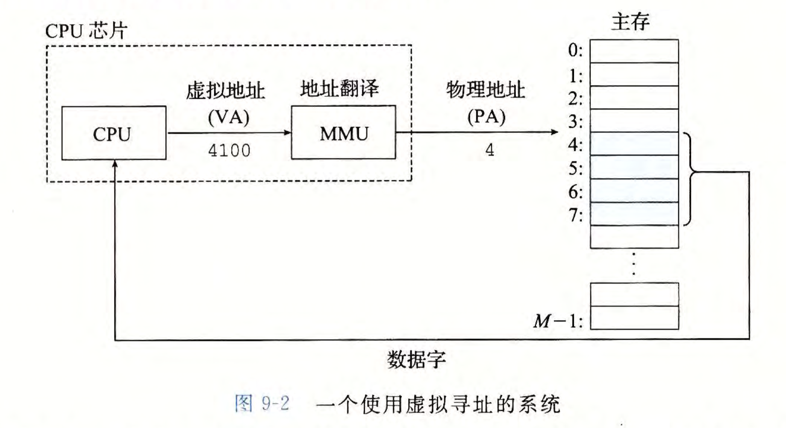

# 前言
一个系统中的进程是与其他进程共享CPU和主存资源的。
对主存的抽象概念——虚拟内存（VM）。
虚拟内存主要机制：
`1` 将主存看成是一个存储在磁盘上的地址空间的高速缓存，在主存中只保存活动区域，并根据需要在磁盘和主存之间来回传送数据，通过这种方式高效使用主存。
`2` 为每个进程提供一致的地址空间，简化内存管理。
`3` 保护每个进程的地址空间不被其他进程破坏。

# 9.1 物理和虚拟寻址
计算机系统的主存被组织成一个由M个连续的字节大小的单元组成的数组。每字节都有一个唯一的物理地址(Physical Address,PA)。
第一个字节的地址为0，接下来的字节地址为1，在下一个为2，以此类推。
`1` 物理寻址。CPU访问内存最自然的方式是使用物理地址。

这个例子中，执行一个加载指令，读取从物理地址4处开始的4字节字。CPU执行这条加载指令时，会生成一个有效物理地址，通过内存总线，传递给主存。主存取出从物理地址4处开始的4字节字，然后返回给CPU，CPU将其存放在一个寄存器中。

`2` 虚拟地址寻址。CPU通过生成一个虚拟地址(Virtual Address,VA)来访问主存，这个虚拟地址在被送到内存之前先转换成适当的物理地址（这一步叫做地址翻译(address translation)）。

地址翻译需要CPU硬件和操作系统之间的紧密合作。
CPU芯片上有一个专用硬件——内存管理单元(Memory Management Unit, MMU)，利用存放在主存中的查询表动态翻译虚拟地址，该表的内存由操作系统管理。

# 9.2 地址空间
地址空间(address space)为一个非负整数地址的有序集合:
**{0,1,2,...}**
若地址空间整数连续，则这个地址空间为线性地址空间(linear address space)。
在一个带虚拟内存的系统中，CPU从一个$N=2^{n}$个地址的地址空间中生成虚拟地址，则这个地址空间称为虚拟地址空间(virtual address space):
**{0,1,2,...,N-1}**

一个地址空间的大小由表示最大地址所需要的位数来描述。一个包含$2^{n}$个地址的虚拟地址空间叫做一个$n$位地址空间。现代系统通常支持32位或者64位虚拟地址空间。

一个系统还有一个物理地址空间(physical address space)，对应于系统中物理内存的M个字节:
**{0,1,2,...,M-1}**
M不一定是2的幂，不过为了简化，假设$M=2^{m}$。

`一点补充`:

1. **虚拟地址空间**：
   - 虚拟地址空间的大小主要由处理器的架构决定，比如32位处理器对应的虚拟地址空间大小为$2^{32}$（4 GB），而64位处理器对应的虚拟地址空间大小为$2^{64}$（理论上是16 EB，但实际上受限于操作系统实现）。
   - 虚拟地址空间并不直接与物理内存大小相关，它是一个由操作系统和处理器共同提供的抽象，使得每个进程都可以拥有独立的、连续的地址空间。

2. **物理地址空间**：
   - 物理地址空间的大小由计算机的实际硬件决定，也就是物理内存（RAM）的大小。例如，你的计算机可能配备8 GB、16 GB或32 GB的内存。
   - 处理器和操作系统也会限制可以直接寻址的物理地址空间。例如，32位处理器通常最多支持4 GB的物理地址空间，即使安装了更大的物理内存也无法全部利用（需要使用PAE等扩展技术）。64位处理器理论上支持更大的物理地址空间，但实际可用大小也受主板设计、操作系统版本等因素限制。

### 总结：
- 虚拟地址空间由**处理器位宽**和**操作系统的实现**决定。
- 物理地址空间由**实际的物理内存大小**以及**硬件和操作系统的支持**决定。
两者之间通过内存管理单元（MMU）进行映射，操作系统负责维护虚拟地址到物理地址的映射关系。

地址空间区分了数据对象（字节）和它们的属性（地址）。允许每个数据对象有多个独立的地址，其中每个地址都选自一个不同的地址空间。
主存中的每字节都有一个选自虚拟地址空间的虚拟地址和一个选自物理地址空间的物理地址。

`关于主存的一点说明`:

**主存**（Main Memory，也称为**主存储器**或**内存**）是计算机中存储数据和指令的主要存储区域，CPU直接从主存中读取数据或将数据写入主存，是整个计算机存储体系中的核心部分。  

### 主存的关键特点  
1. **高速性**：  
   主存的存取速度比外部存储（如硬盘、SSD）快得多，因此它被用作处理器的直接存储资源。  

2. **易失性**：  
   主存通常使用DRAM（动态随机存储器）作为实现技术，它是一种**易失性存储器**，即在断电后数据会丢失。  

3. **容量适中**：  
   主存的容量通常比硬盘小，但比CPU缓存大得多。典型的现代主存容量范围是8GB到128GB。

### 主存的作用  
1. **存储程序和数据**：  
   主存中保存正在运行的程序代码和数据，供CPU随时访问。  

2. **提供工作空间**：  
   主存为操作系统和应用程序提供临时存储工作区，支持程序运行时的动态操作。  

3. **缓冲外设数据**：  
   主存还充当CPU与外部设备（如硬盘、显示器）之间的缓冲区，以提高数据交换效率。  

### 主存与其他存储设备的关系  
1. **与CPU的关系**：  
   - 主存是CPU直接访问的存储器，比硬盘、SSD等外部存储速度快得多。  
   - CPU通过总线与主存进行通信，数据和指令首先从主存中被取出，放入CPU的寄存器中进行处理。  

2. **与缓存的关系**：  
   - 主存的速度仍然比CPU处理速度慢，因此处理器通常配备更小、更快的缓存（Cache），用来暂时存储经常访问的数据。  
   - CPU优先从缓存中读取数据，如果未命中缓存，则访问主存。  

3. **与硬盘的关系**：  
   - 主存与硬盘相比速度快但容量小，硬盘用于长期存储数据，而主存用于临时存储正在运行的数据。  
   - 当主存空间不足时，操作系统可能会使用硬盘上的**虚拟内存**来临时扩展主存的功能，但性能会受到影响。  

### 主存的实现技术  
1. 动态随机存储器（DRAM）：现代计算机主存的主流实现技术，成本低，容量大。  
2. 静态随机存储器（SRAM）：速度快，但成本高，通常用于CPU缓存，而非主存。  

### 总结  
主存是计算机体系结构中不可或缺的组件，它连接了CPU与外部存储设备，承担了数据存储与交换的重要角色。它的性能对整个计算机系统的效率有直接影响。

# 9.3 虚拟内存作为缓存的工具
malloc函数传入的参数单位是字节（1byte，8bits）。
确定块大小的一般方法是将所请求的有效载荷和头部的大小的和舍入到对齐要求（一般来说是8字节或者16字节）最近的整数倍。
ICS课本上在虚拟内存这一章中，一字表示4字节。
最小块大小是最小的已分配块大小和最小空闲块大小两者的最大值。
内核态转换为用户态时，才会处理信号。
